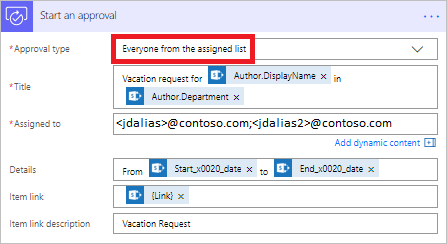
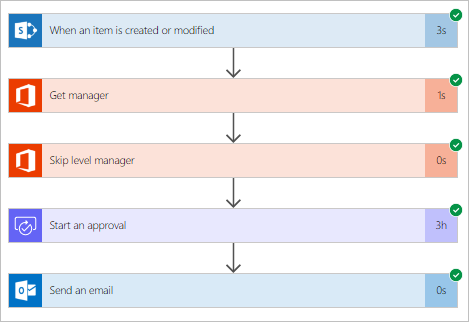
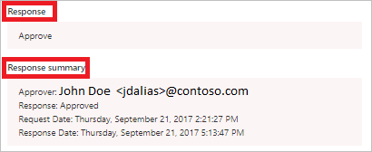

# 创建一个必需所有人批准的审批流
本演练介绍如何创建一个审批工作流，该工作流必需所有人（所有分配的审批者）都同意才能使验证得到批准，但任何审批者都可以拒绝整个申请。

在需要个人的管理者和管理者的管理者都同意休假申请才能使其获得批准的组织中，此类型的审批工作流非常有用。 但是，任一管理者均可拒绝该申请，无需其他人的意见。

## 先决条件
* 对 [Microsoft Flow](https://flow.microsoft.com)、Office 365 Outlook 和 Office 365 用户的访问权限。
* SharePoint Online [列表](https://support.office.com/article/SharePoint-lists-I-An-introduction-f11cd5fe-bc87-4f9e-9bfe-bbd87a22a194)。
  
    本演练假设已创建了用于申请休假的 SharePoint Online 列表。 有关详细介绍 SharePoint 列表可能呈现的状态的详细示例，请参阅[并行审批](parallel-modern-approvals.md)演练。
* 熟悉创建流的基础知识。
  
    可以查看如何添加[操作、触发器](multi-step-logic-flow.md#add-another-action)和[条件](add-condition.md)。 以下步骤假设用户了解如何执行这些操作。

> [!NOTE]
> 虽然我们在本演练中使用 SharePoint Online 和 Office 365 Outlook，但也可以使用其他服务，例如 Zendesk、Salesforce、Gmail 或 Microsoft Flow 支持的超过 [150 款服务](https://flow.microsoft.com/connectors/)中的任意一款。
> 
> 

## 创建流
> [!NOTE]
> 如果之前未创建与 SharePoint 或 Office 365 的连接，请在收到登录提示时按照说明进行操作。
> 
> 

本演练使用令牌。 若要显示令牌列表，请点击或单击任意输入控制，然后在打开的“动态内容”列表中搜索该令牌。

登录到 [Microsoft Flow](https://flow.microsoft.com) 中，然后执行以下步骤来创建流。

1. 依次选择“我的流” > “从空白创建”。
2. 添加 **SharePoint - 当创建或修改项时**触发器。
3. 为承载休假申请列表的 SharePoint 站点输入 **Site Address**，然后从“列表名称”框中选择该列表。
4. 添加 **Office 365 用户 - 获取管理者**操作，然后将**由电子邮件创建**令牌添加到“用户 (UPN)”框。
   
    **由电子邮件创建**令牌位于“动态内容”列表的“当创建或修改项时”类别之下。
5. 添加另一个 **Office 365 用户 - 获取管理者**操作，然后将**电子邮件**令牌添加到“用户 (UPN)”框。
   
    **电子邮件**令牌位于“动态内容”列表的“获取管理者”类别之下。
   
    还可以将“获取管理者 2”卡重命名为有意义的名称，例如“跳过平级管理者”。
6. 添加**启动审批**操作，然后从“审批者类型”列表中选择“已分配列表中的所有人”。
   
   > [!IMPORTANT]
   > 如果有任何审批者拒绝，则该审批申请对所有审批者来说都视为已拒绝。
   > 
   > 
7. 使用下表作为完成“启动审批”卡的指南。
   
   | 字段 | 说明 |
   | --- | --- |
   |  审批类型 |使用“已分配列表中的任何人”指示任意一个审批者都可以批准或拒绝该申请。 
使用**“已分配列表中的任何人”**指示申请仅在所有人都同意时才获得批准，只要有一人拒绝，便拒绝该申请。 |
   |  标题 |审批申请的标题。 |
   |  分配到 |审批者的电子邮件地址。 |
   |  详细信息 |要发送给“分配到”字段中列出的审批者的任何其他信息。 |
   |  项链接 |审批项的 URL。 在此示例中，这是指向 SharePoint 中的项的链接。 |
   |  项链接说明 |**项链接**的文字说明。 |
   
   > [!TIP]
   > **启动审批**操作提供多个令牌，包括**响应**和**响应摘要**。 在流中使用这些流来为审批申请流的运行提供丰富的结果报告。
   > 
   > 
   
    “启动审批”卡是发送给审批者的审批申请的模板。 以对组织有用的方式配置它。 下面是一个示例。
   
    
8. 添加 **Office 365 Outlook - 发送电子邮件**操作，然后将其配置为发送包含申请结果的电子邮件。
   
    以下示例展示了“发送电子邮件”卡可能呈现的外观。
   
    

> [!NOTE]
> **启动审批**操作后的任何操作都基于在“启动审批”卡上的“审批类型”中的所选内容来运行。 下表列出了基于所选内容的行为。
> 
> 

| 审批类型 | 行为 |
| --- | --- |
| 已分配列表中的任何人 |**启动审批**操作后的任何操作都在任何一个审批者决定之后运行。 |
| 已分配列表中的所有人 |**启动审批**操作后的操作在一个审批者拒绝或所有人批准申请后运行。 |

在屏幕顶部，在“流名称”框中输入流名称，然后选择“创建流”来保存它。

祝贺你，流已完成！ 如果按照步骤操作，流将如下图所示。

现在，每当 SharePoint 列表中的项发生更改时，流都会触发，并向“启动审批”卡的“分配到”框中列出的所有审批者发送审批申请。 流通过 Microsoft Flow 移动应用和通过电子邮件发送审批申请。 在 SharePoint 中创建该项的人将收到总结了结果的电子邮件，明确指示已批准还是已拒绝该申请。

下面是发送给每个审批者的审批申请的示例。

以下示例展示在流运行后响应和响应摘要可能呈现的外观。

## 了解有关审批的详细信息
* [单个审批者现代审批](modern-approvals.md)
* [顺序现代审批](sequential-modern-approvals.md)
* [并行现代审批](sequential-modern-approvals.md)

