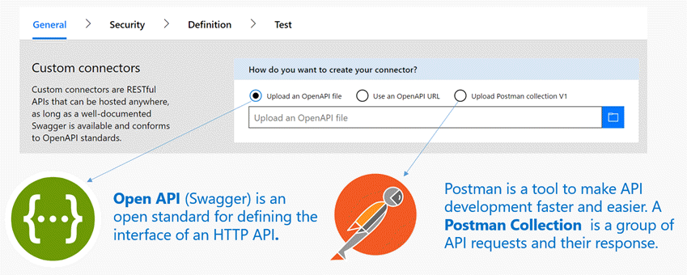

# 开发 API 连接器 (Microsoft Flow)
生成连接器涉及多个步骤。 若要开始，请在 [Microsoft Flow](https://flow.microsoft.com/) 中单击或点击页面右上角的“设置”按钮（齿轮图标）。 然后，单击或点击“自定义连接器”。

## 描述 API
API 连接器使用 [OpenAPI 标准](https://swagger.io/)进行描述，该标准适用于定义 HTTP API 的接口。 可以使用现有的 OpenAPI 文件开始生成操作，也可以通过导入 [Postman Collection](https://www.getpostman.com/docs/collections) 来自动生成 OpenAPI 文件。 

如果按照上述任一 API 说明开始操作，将会自动填充向导中的元数据字段。 可以随时编辑这些字段。  

## 生成安全性
选取服务支持的身份验证类型并提供其他详细信息，以便标识能够在服务和任何客户端之间正常传输。 

[详细了解](register-custom-api.md)连接器安全性。

## 生成触发器和操作
1. 若要为连接器生成触发器和操作，请切换到“定义”选项卡。 
   
    
2. 可以使用向导添加新操作，或者编辑现有操作的架构和响应。 可以通过每个操作的“常规”属性控制连接器的最终用户体验。 请通过以下链接详细了解不同类型的操作：
   
   * [触发器](customapi-webhooks.md)（在 PowerApps 中不可见）
   * [操作](register-custom-api.md)
     
     若要实现 Microsoft Flow 的高级功能，请参阅 [API 连接器的 OpenAPI 扩展](https://flow.microsoft.com/documentation/customapi-how-to-swagger/)。 
3. 最后，请单击或点击“创建连接器”，以便注册 API 连接器。

如需向导中未提供的其他功能，请联系 [condevhelp@microsoft.com](mailto:condevhelp@microsoft.com)。

## 测试连接器
在提交之前，请通过一种或多种方式测试 API 连接器： 

* 可以通过 API 连接器[测试向导](https://flow.microsoft.com/blog/new-updates-custom-api/)调用每个操作，以便验证其功能和响应架构。
* 在适用于 Microsoft Flow 的设计器中，可以使用 API 连接器直观地生成流。 可以通过此测试方法查看用户界面功能以及连接器的功能。
* 在 PowerApps Studio 中，可以通过公式栏调用每个操作，并将响应绑定到屏幕上的控件。

本主题为概述性主题；有关详细信息，请参阅[注册和使用自定义连接器](register-custom-api.md)。

