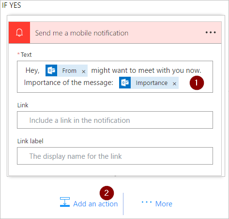

# 使用 Microsoft Flow 中的“应用到每个操作”可定期处理一系列的项目
许多触发器可以基于某个事件（例如，当新的电子邮件到达收件箱中时）立即启动流。 这些触发器很好，但有时你想要运行某个流以便按照预定义计划查询数据源，根据数据源中项目的属性执行某些操作。 为此，可以按照计划（如每日一次）启动流，并且使用循环操作（如“应用到每个”）处理一系列的项目。 例如，可以使用“应用到每个”来更新数据库中的记录或 Microsoft SharePoint 中的一系列项目。

在本演练中，我们将创建每 15 分钟运行一次并执行以下任务的流：

1. 获取 Office 365 Outlook 收件箱中最后 10 封未读的邮件。
2. 检查 10 封邮件中的每一封，以确认是否有某封邮件的主题中包含“立即开会”。
3. 检查是否该电子邮件来自于你的老板或已在重要性标记为“高”的情况下发送。
4. 发送推送通知，并将满足以下条件的任何电子邮件标记为已读：主题中包含“立即开会”，并且来自于你的老板或已在重要性标记为“高”的情况下发送。

此图显示了我们将在本演练中创建的流的详细信息：

## 先决条件
下面是在此演练中成功执行这些步骤的要求：

* 为使用 [Microsoft Flow](https://flow.microsoft.com) 而注册的帐户。
* Office 365 Outlook 帐户。
* 适用于 [Android](https://aka.ms/flowmobiledocsandroid)、[iOS](https://aka.ms/flowmobiledocsios) 或 [Windows Phone](https://aka.ms/flowmobilewindows) 的 Microsoft Flow 移动应用。
* 与 Office 365 Outlook 和推送通知服务的连接。

## 创建流
1. 登录到 [Microsoft Flow](https://flow.microsoft.com)：
2. 选择“我的流”选项卡，然后从空白创建一个流：
   
    
3. 在搜索框中输入“计划”以搜索所有与制定计划相关的服务和触发器。
4. 选择“计划 - 重复周期”触发器，以指示你的流将按照随后你将提供的计划运行：
   
    
5. 将计划设置为每 15 分钟运行一次：
   
    
6. 依次选择“+ 新步骤”、“添加操作”，然后将 **outlook** 键入到搜索框以搜索所有与 Microsoft Outlook 相关的操作。
7. 选择“Office 365 Outlook - 获取电子邮件”操作：
   
    
8. 这将打开“获取电子邮件”卡。 将“获取电子邮件”卡配置为从收件箱文件夹中选择顶部的 10 封未读电子邮件。 请勿包含附件，因为不会在流中使用它们：
   
    
   
   > [!NOTE]
   > 到目前为止，你已创建可从收件箱获取一些电子邮件的简单流。 这些电子邮件将以数组的形式返回；“应用到每个”操作需要一个数组，因此这正是所需的。
   > 
   > 

## 添加操作和条件
1. 依次选择“+ 新步骤”、“更多”、“添加‘应用到每个’”操作：
   
    
2. 将“正文”标记插入到“应用到每个”卡上的“从先前的步骤中选择一个输出”框中。 这将拉入要在“应用到每个”操作中使用的电子邮件正文：
   
    
3. 选择“添加条件”：
   
    
4. 配置“条件”卡以在每封电子邮件的主题中搜索词“立即开会”：
   
   * 将“主题”标记插入到“对象名称”框中。
   * 在“关系”列表中选择“包含”。
   * 在“值”框输入“立即开会”。
     
     
5. 选择“更多”，然后从“如果是，则不执行任何操作”分支选择“添加条件”。 这将打开“条件 2”卡；配置该卡，如下所示：
   
   * 将“重要性”标记插入到“对象名称”框中。
   * 在“关系”列表中选择“等于”。
   * 将“高”输入到“值”框中。
     
     
6. 选择“如果是，则不执行任何操作”部分下的“添加操作”。 这将打开“选择操作”卡，其中你将定义在满足搜索条件（“立即开会”电子邮件已在重要性标记为“高”的情况下发送）时应发生的操作：
   
    
7. 搜索**通知**，然后选择“通知 - 向我发送移动通知”操作：
   
    
8. 在“向我发送移动通知”卡上，为将在电子邮件的主题包含“立即开会”的情况下发送的推送通知提供详细信息，然后选择“添加操作”：
   
    
9. 输入“已读”作为搜索词，然后选择“Office 365 Outlook - 标记为已读”操作。 这会在发送推送通知后将每封电子邮件标记为已读：
   
    
10. 将“消息 ID”标记添加到“标记为已读”卡的“消息 ID”框。 可能需要选择“查看更多”来查找“消息 ID”标记。 这指示将被标记为已读的消息的 ID：
    
     
11. 返回到“条件 2”卡上的“如果否，则不执行任何操作”分支：
    
    * 选择“添加操作”，然后将“获取经理”键入到搜索框中。
    * 从搜索结果列表中选择“Office 365 用户 - 获取经理”操作。
    * 将你的 完整电子邮件地址输入到“获取经理”卡的“用户”框中。
      
      
12. 选择“更多”，然后从“如果否”分支选择“添加条件”。 这将打开“条件 3”卡；将该卡配置为检查电子邮件发件人的电子邮件地址（“发件人”标记）是否与你老板的电子邮件地址（“电子邮件”标记）相同：
    
    * 将“发件人”标记插入到“对象名称”框中。
    * 在“关系”列表中选择“包含”。
    * 将“电子邮件”标记输入到“值”框中。
      
      
13. 选择“条件 3”卡的“如果是，则不执行任何操作”部分下的“添加操作”。 这将打开“如果是”卡，其中你将定义在满足搜索条件（电子邮件来自于你的老板）时应发生的操作：
    
     
14. 搜索**通知**，然后选择“通知 - 向我发送移动通知”操作：
    
     
15. 在“向我发送移动通知 2”卡上，为将在电子邮件来自于你老板的情况下发送的推送通知提供详细信息，然后选择“添加操作”：
    
     
16. 添加“Office 365 Outlook - 标记为已读”操作。 这会在发送推送通知后将每封电子邮件标记为已读：
    
     
17. 将“消息 ID”标记添加到“标记为已读 2”卡。 可能需要选择“查看更多”来查找“消息 ID”标记。 这指示将被标记为已读的消息的 ID：
    
     
18. 命名你的流，然后创建它：
    
     

如果你一直按照上述说明执行操作，你的流应类似于此图：

## 运行流
1. 向自己发送在主题中包括“立即开会”的高重要性电子邮件（或者让组织中的某人向你发送这样的电子邮件）。
2. 确认该电子邮件在你的在收件箱中并处于未读状态。
3. 登录到 Microsoft Flow，选择“我的流”，然后选择“立即运行”：
   
    
4. 选择“运行流”以确认你确实想要运行该流：
   
    
5. 几分钟后，你应看到成功运行的结果：
   
    

## 查看运行的结果
现在已成功运行该流，应在移动设备上收到推送通知。

1. 在移动设备上打开 Microsoft Flow 应用，然后选择“活动”选项卡。你将看到有关会议的推送通知：
   
    
2. 若要查看通知的完整内容，你可能需要选择通知。 你将看到完整的通知，类似于以下内容：
   
    
   
   > [!NOTE]
   > 如果没有收到推送通知，请确认移动设备具有有效的数据连接。
   > 
   > 

