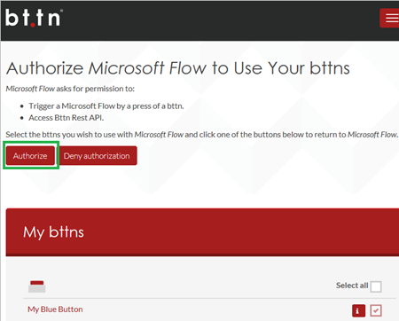
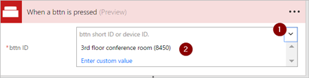

# 使用 The Button Corporation（预览）中的物理按钮 (bttn) 来运行流
通过按 bttn（[The Button Corporation](https://my.bt.tn/) 生产的物理按钮）来触发流。 例如，可以按 bttn 触发一个流来执行以下任务：

* 联系支持人员获取位置信息
* 向团队发送电子邮件
* 对日历进行分块
* 再订购办公用品

> [!IMPORTANT]
> 必须在[注册](https://my.bt.tn/) bttn 后才能在流中使用它。
> 
> [!TIP]
> 在创建流之前，在 [bttn 网站](https://my.bt.tn/)上配置所有 bttn 属性，例如名称、位置以及电子邮件地址。
> 
> 

还可以通过使用 [Flic 物理按钮](flic-button-flows.md)来触发流。

## 先决条件
* 有权访问 [Microsoft Flow](https://flow.microsoft.com)。
* 至少一个[已注册的 bttn](https://my.bt.tn/)。

## 创建由 Flic 触发的流
在本演练中，我们使用支持人员模板来创建可以通过单次按下 [bttn](https://my.bt.tn/) 触发的流。 流运行时，它将生成支持请求，然后将该请求发送给支持人员。 支持请求为支持人员提供需要帮助的房间位置。 本演练演示如何从模板中创建此流，但是还可以使用空白模板，这样用户能够完全控制流的各个方面。

可以使用任何这些模板为 bttn 快速创建流并连接到 Zendesk、Google 和 SharePoint 等：

提示：出于本演练的目的，请对 bttn 命名，该名称表示典型办公楼中的会议室。

bttn 的设置应类似于以下示例（摘自 bttn 网站）：

现在，你已注册并配置 bttn，让我们开始创建流。

### 登录并选择模板
1. 登录到 [Microsoft Flow](https://flow.microsoft.com)。
   
    
   
    注意：可以在适用于 [Android](https://aka.ms/flowmobiledocsandroid)、[iOS](https://aka.ms/flowmobiledocsios) 或 [Windows Phone](https://aka.ms/flowmobilewindows) 的 Microsoft Flow 移动应用中创建流，作为一种替代。
2. 在搜索栏中输入“bttn”，然后选择搜索图标。
   
    
   
    选择“搜索”图标后，将显示可用于 bttn 的所有模板。
3. 选择“使用 Bttn 调用会议室的技术支持”模板。
   
    

### 授权 Microsoft Flow 连接到 bttn
1. 如果系统提示，请登录到 bttn 和 Office 365 Outlook 服务，以启用“继续”按钮。
   
    
2. 登录到 bttn 服务时，授权 Microsoft Flow 使用 bttn。
   
    重要说明：如果未授权 Microsoft Flow 使用 bttn，则无法从 Microsoft Flow 查看或连接到它们。
   
    
3. 登录到这两个服务后，选择“继续”。
   
    

### 选择触发流的 bttn
1. 在“按下 bttn 时”卡上，打开 bttn ID 列表，然后选择想要使用的 bttn。
   
    
   
    流现在应类似于以下示例。
   
    
2. 给流命名，然后选择“创建流”进行保存。
   
    

## 测试流并确认结果
1. 按 bttn 上的按钮。
2. 查看流的运行历史记录，以确认它已成功运行。
   
    可以在 Microsoft Flow 网站或移动设备上查看运行历史记录。
   
    注意：在支持请求电子邮件中选择“确认”之前，运行状态设置为“正在运行”。
3. 还可以确认电子邮件已发送给支持团队。
   
    如果已按照步骤执行操作，支持电子邮件将类似于以下示例：
   
    

## 故障排除
* 如果流尚未触发，则登录到 The Button Corporation 的站点，并确认是否已记录按钮活动（按下）。
* 此外，还可以深入了解 Microsoft Flow 站点上的运行活动，并检查错误消息。

## 详细信息
* [共享按钮流](share-buttons.md)。
* 了解如何在按钮流运行时使用[按钮触发器令牌](introduction-to-button-trigger-tokens.md)发送当前数据。
* [安装适用于 Android 的 Microsoft Flow 应用](https://aka.ms/flowmobiledocsandroid)。
* [安装适用于 iOS 的 Microsoft Flow 应用](https://aka.ms/flowmobiledocsios)。

