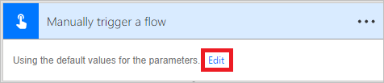
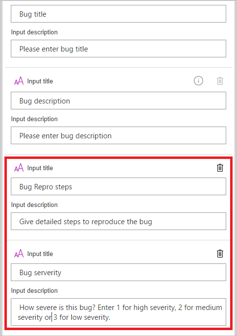

# 带有用户输入的按钮流简介
创建按钮流能够仅仅点击一个按钮即可运行日常任务。 通过允许用户提供要在流运行时使用的特定详细信息，来自定义你的流。 本主题将指导你完成创建一个用于获取用户输入的按钮流，然后运行该按钮流，并突出显示如何提供用户输入。

可以在 Microsoft Flow 网站或 Microsoft Flow 的移动应用中创建按钮流。 对于本主题，我们将使用网站。

### 先决条件
* Microsoft Flow 网站上的帐户。

## 打开模板
1. 登录到 [Microsoft Flow 网站](https://flow.microsoft.com)，在搜索框中输入 **Visual Studio**，然后单击或点击搜索图标，以查找与 Visual Studio 相关的所有模板：
   
      
2. 选择“在 Visual Studio 中打开优先级为 2 的 Bug”模板：
   
      
3. 选择“使用此模板”按钮：
   
      
   
    此模板使用 Visual Studio Team Services (VSTS) 和推送通知服务。 如果与其中任一服务没有连接，你将需要登录到这些服务。 仅当需要登录到服务时，才会显示“登录”按钮。
4. 登录到所有所需的服务后，选择“继续”按钮：
   
      
5. （可选）通过在门户顶部的框中键入你选择的名称来更改流名称：
   
    

## 自定义用户输入
1. 在触发器卡中，选择“编辑”：
   
      
2. 选择 **+** 图标以展开页面，以便可以添加自定义输入字段：
   
    
3. 为你希望在有人运行你的流时可用的每个自定义字段输入**输入标题**和**输入说明**。  
   
    在此示例中，你将创建两个自定义输入字段（**Bug 重现步骤**和 **Bug 严重性**），以便使用此流的任何人都可以输入用于重现该 Bug 并为该 Bug 的严重性评级的步骤：  
   
    

## 自定义 Bug
1. 点击“创建新的工作项”卡的标题栏：
   
      
2. 做出适合于你的 VSTS 环境的选择，然后选择“编辑”：
   
    例如，通过键入 **myinstance** 连接到 myinstance.visualstudio.com。
   
      
3. 选择“显示高级选项”以显示此卡的其他字段：
   
      
4. 将光标置于“Bug 标题”标记之前，然后将“严重性：”输入到“标题”文本字段。
5. 当光标仍位于标题文本字段中时，选择“Bug 严重性”标记，然后输入“ -- ”。  
6. 在“说明”文本字段中，将光标置于紧邻“Bug 说明”标记之后，然后按 Enter 以另起一个新行。
7. 将光标置于新行中，然后选择“Bug 重现步骤”标记：
   
    

## 自定义推送通知
1. 点击“发送推送通知”卡上的标题栏以将其展开。
2. 在动态内容标记列表中，选择“查看更多”，然后在“链接”文本字段中添加“URL”标记。
3. 在“链接标签”文本字段中，添加“Id”标记：
   
      
4. 点击菜单上的“创建流”以创建流：  

## 运行流
在本演练中将使用 Microsoft Flow 的移动应用来运行你刚刚创建的按钮流。 你将提供创建带有标题、说明、重现步骤和严重性级别的 Bug 所需的所有用户输入。  

1. 在 Microsoft Flow 的移动应用中，点击“按钮”选项卡，然后点击“创建带步骤的 Bug 报告”按钮。
   
      
2. 为要报告的 Bug 输入标题，然后点击“下一步”。 例如：
   
      
3. 输入要报告的 Bug 的说明，然后点击“下一步”。 例如：
   
      
4. 输入用于重新要报告的 Bug 的步骤，然后点击“下一步”。 例如：
   
      
5. 输入要报告的 Bug 的严重性，然后点击“下一步”。  
      
   
    流将运行。
6. （可选）点击“活动”选项卡以显示结果。
   
      
7. （可选）通过点击“创建新的工作项”步骤来显示流运行的详细结果。
   
      

## 后续步骤
* [共享按钮流](share-buttons.md)
* [了解流](guided-learning/get-started.yml?tutorial-step=1)  
* [了解按钮流](introduction-to-button-flows.md)  
* [了解带有触发器令牌的按钮流](introduction-to-button-trigger-tokens.md)  

