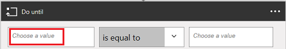

# 使用 Microsoft Flow 和 Microsoft 通用数据服务生成审批循环
用户可以使用通用数据服务生成流，将信息存储在独立于流的数据库中。 此方面的最佳示例是审批。 如果将审批状态存储在实体中，则可在其基础上使用流。

在此示例中，需创建一个审批流程，该流程从用户将文件添加到 Dropbox 开始。 添加文件以后，其相关信息就会显示在应用中，供审阅者批准或拒绝所做的更改。 在审阅者批准或拒绝所做的更改以后，将会发送通知邮件，并会从 Dropbox 中删除拒绝的文件。

遵循此部分的步骤操作即可生成以下内容：

* **自定义实体**：其中包含添加到 Dropbox 中的每个文件的相关信息，以及文件的状态是“已批准”、“已拒绝”还是“挂起”。
* **流**：当文件被添加到 Dropbox 时向自定义实体添加信息，当文件被批准或拒绝时发送邮件，以及删除被拒绝的文件。 以下步骤演示如何从头开始生成此类流，不过也可通过模板创建类似的流。
* **应用**：审阅者可以在其中批准或拒绝添加到 Dropbox 的文件。 需使用 PowerApps 根据自定义实体中的字段自动生成此应用。

**先决条件**

* 注册到 [Microsoft Flow](sign-up-sign-in.md) 和 [PowerApps](https://powerapps.microsoft.com/en-us/tutorials/signup-for-powerapps/)。
* 根据 [Manage your connections](https://powerapps.microsoft.com/tutorials/add-manage-connections/)（管理连接）中的说明，创建到 Dropbox 和 Office 365 Outlook 的连接。

## 生成实体
1. 登录到 [powerapps.com](https://web.powerapps.com)。
2. 如果默认情况下不显示左侧导航栏，请单击或点击左上角带三个水平线条的图标。
   
    
3. 在左侧导航栏中，单击或点击“管理”，然后单击或点击“实体”。
   
    
4. 如果系统提示，请单击或点击“创建数据库”。
   
    
5. 在右上角附近单击或点击“新建实体”。
   
    
   
    如果浏览器窗口没有最大化，此按钮可能会出现在其他位置。
6. 在“实体名称”下，指定一个不包含空格且尚未被数据库中其他实体使用的名称。
   
    若要严格按此示例操作，请指定 **ReviewDropboxFiles**。
   
    
7. 在“显示名称”下，指定一个易记名称。
   
    
8. 单击或点击“下一步”。
   
    

## 将字段添加到实体
1. 在右上角附近单击或点击“添加字段”。
   
    
2. 在显示在字段列表底部的空行中，设置“审批者”字段的属性。 （设置这些属性时，按 Tab 键即可切换到下一列。）
   
   * 在“显示名称”列中，键入“审批者”。
   * 在“名称”列中，键入“ApproverEmail”。
   * 在“类型”列中，单击或点击“电子邮件”选项。
   * 在“必需”列中，选中相应的复选框。
     
     
3. 在下一行中，设置“状态”字段的属性：
   
   * 在“显示名称”列中，键入“状态”。
   * 在“名称”列中，键入“状态”。
   * 在“类型”列中，单击或点击“文本”选项。
   * 在“属性”列中，保留默认值。
   * 在“必需”列中，选中相应的复选框。
     
     
4. 在下一行中，设置“FileID”字段的属性：
   
   * 在“显示名称”列中，键入“文件标识符”。
   * 在“名称”列中，键入“FileID”。
   * 在“类型”列中，单击或点击“文本”选项。
   * 在“属性”列中，保留默认值。
   * 在“唯一”列中，选中相应的复选框。
   * 在“必需”列中，选中相应的复选框。
     
     
5. 在右侧靠近边缘的地方，单击或点击与“FileID”字段相对应的省略号 (...)，然后单击或点击“设置为标题字段”。
   
    
6. 在左下角附近单击或点击“创建”。
   
    
7. （可选）当实体列表重新显示时，如果浏览器窗口尚未最大化，可将其最大化，然后单击或点击“类型”列标题。 此列表使用自定义实体（例如显示在顶部的刚创建的实体）排序。

## 登录并创建流
1. 打开 [Microsoft Flow 门户](https://flow.microsoft.com)。
2. 如果浏览器窗口尚未最大化，请将其最大化，然后单击或点击右上角附近的“登录”。
   
    
3. 在右上角菜单中，选择用户在 powerapps.com 中创建数据库的环境。
   
    **注意**：如果未选择相同的环境，则将看不到用户的实体。
4. 在左下角附近单击或点击“我的流”。
   
    
5. 在右上角附近单击或点击“创建新流”。
   
    

## 添加文件时启动
1. 在包含“搜索更多触发器”的框中，键入或粘贴“Dropbox”，然后单击或点击“Dropbox - 创建文件时”。
   
    
2. 在“文件夹”下，单击或点击文件夹图标，然后浏览到将在其中添加文件的文件夹。
   
    

## 将数据添加到实体
1. 单击或点击“新建步骤”，然后单击或点击“添加操作”。
   
    
2. 在包含“搜索更多操作”的框中，键入或粘贴“通用数据服务”，然后单击或点击“通用数据服务 - 创建对象”。
   
    
3. 在“实体”下，键入或粘贴“审阅”，然后单击或点击“审阅 Dropbox 文件”。
   
    
4. 在“标题”下，单击或点击相应的框，然后单击或点击参数标记列表中的“文件名”，将该标记添加到字段中。
   
    
5. 在“审批者”下，键入或粘贴将审阅文件的人员的电子邮件地址。
   
    **注意**：若要使流的测试更容易些，请指定自己的地址。 可以在以后当流能够实际使用时对其进行更改。
   
    
6. 在“状态”下，键入或粘贴“挂起”。
   
    
7. 在“文件标识符”下，单击或点击相应的框，然后单击或点击参数标记列表中的“文件标识符”，将该标记添加到字段中。
   
    

## 检查是否已审阅过该文件
1. 在“创建对象”操作下，依次单击或点击“新建步骤”、“更多”和“添加操作停止条件”。
   
    
2. 在“操作停止条件”操作的左上角，单击或点击包含“选择值”的框。
   
    
   
    **注意**：如果浏览器窗口没有最大化，请单击或点击包含“选择值”的上部框。
3. 在“从创建对象输出”下，单击或点击“状态”，将该参数标记添加到字段。
   
    
4. 打开靠近“操作停止条件”操作中心的列表，然后单击或点击“不等于”。
   
    
5. 在“操作停止条件”操作的右上角，在包含“选择值”的框中键入或粘贴“挂起”。
   
    
   
    **注意**：如果浏览器窗口没有最大化，请单击或点击包含“选择值”的下部框。
6. 在“操作停止条件”操作的底部附近，单击或点击“添加操作”。
   
    
7. 在包含“搜索更多操作”的框中，键入“通用”，然后单击或点击“通用数据服务 - 获取对象”。
   
    
8. 在“命名空间”下，单击或点击数据库。
9. 在“实体”下，键入或粘贴“审阅”，然后单击或点击“审阅 Dropbox 文件”。
   
    
10. 在“对象 ID”下，单击或点击相应的框，然后单击或点击“文件标识符”参数标记，将其添加到字段中。
    
     

## 检查项目是否已批准
1. 在“操作停止条件”操作下，单击或点击“新建步骤”，然后单击或点击“添加条件”。
   
    
2. 在条件的左上角，单击或点击包含“选择值”的框。
   
    
   
    **注意**：如果浏览器窗口没有最大化，请单击或点击包含“选择值”的上部框。
3. 在“从获取对象输出”下，单击或点击“状态”参数标记，将其添加到字段。
   
    
4. 在条件的右上角，在包含“选择值”的框中键入或粘贴“已批准”。
   
    
   
    **注意**：如果浏览器窗口没有最大化，请在包含“选择值”的下部框中键入或粘贴“已批准”。

## 发送通知邮件
1. 在“如果是，则不执行任何操作”下，单击或点击“添加操作”。
   
    
2. 在包含“搜索更多操作”的框中，键入或粘贴“发送邮件”，然后单击或点击“Office 365 Outlook - 发送电子邮件”。
   
    
3. 在“收件人”下，键入或粘贴在接受某个项目时需通知的人员的地址。
   
    **注意**：若要使流的测试更容易些，请指定自己的地址。 可以在流能够实际使用时对其进行更改。
   
    
4. 在“主题”下，单击或点击相应的框，然后单击或点击“文件名”参数标记，将其添加到字段中。
   
    
5. 在“正文”下，键入或粘贴“项目已批准。”
   
    
6. 在“如果否，则不执行任何操作”下，重复本过程的步骤 1-5，区别是将电子邮件消息的正文指定为“项目已拒绝。”
   
    

## 删除被拒绝的文件
1. 在拒绝邮件的字段下，单击或点击“添加操作”。
   
    
2. 在包含“搜索更多操作”的框中，键入或粘贴“Dropbox”，然后单击或点击“Dropbox - 删除文件”。
   
    
3. 在“文件”下，单击或点击相应的框，然后单击或点击“文件标识符”标记参数，将其添加到字段中。
   
    

## 保存流
1. 在屏幕顶部，键入或粘贴要创建的流的名称，然后单击或点击“创建流”。
   
    
2. 单击或点击“关闭”，然后单击或点击“完成”。
3. 在 Dropbox 中，向指定文件夹添加至少两个文件：一个用于测试批准情况，一个用于测试拒绝情况。

## 生成应用
1. 登录到 [powerapps.com](https://web.powerapps.com)，然后单击或点击左侧导航栏底部附近的“新建应用”。
   
    
2. 在显示的对话框中，单击或点击相关选项，打开用于 Windows 的 PowerApps Studio 或用于 Web 的 PowerApps Studio。
3. 如果已打开用于 Windows 的 PowerApps Studio，请在左侧导航栏中单击或点击“新建”。
4. 在“根据数据创建应用”下的“通用数据服务”磁贴中，单击或点击“手机布局”。
   
    
5. 在“搜索”框中，键入或粘贴“审阅”。
   
    
6. 在“选择实体”下，单击或点击“审阅 Dropbox 文件”。
   
    
7. 在右下角附近单击或点击“连接”。
   
    
8. 如果出现简介教程的起始屏幕，可学习该教程，熟悉一下 PowerApps（或者单击或点击“跳过”）。
   
    
   
    用户始终可以在以后学习此教程，只需单击或点击左上方附近的问号图标，然后单击或点击“学习简介教程”即可。
9. （可选）可以在屏幕底部附近拖动滑块来增大缩放比例，使应用看起来更清楚。
   
    

## 自定义应用
1. 在右侧导航栏中，单击或点击包括标头和描述的布局。
   
    
2. 在 **BrowseScreen** 上，单击或点击搜索栏正下方，选择较大的文本框控件。
   
    
3. 在右侧窗格中，单击或点击向下箭头打开下部的列表。
   
    
4. 在下部列表中，单击或点击“标题”，显示已添加文件的文件名。
   
    
5. 在右侧窗格中，打开上部列表，然后单击或点击“状态”，显示每个文件的状态。
   
    

## 测试总体解决方案
1. 在 PowerApps 中，单击或点击左上方附近的播放按钮，打开“预览”模式。
   
    
2. 对于列表中的第一个文件，单击或点击相关箭头即可显示该文件的详细信息。
   
    
3. 在右上角单击或点击铅笔图标，更改该文件的详细信息。
   
    
4. 在“状态”框中，键入或粘贴“已批准”。
   
    
5. 在右上角单击或点击复选标记图标，保存所做的更改并返回到“详细信息”屏幕。
   
    
   
    在数分钟内即可收到电子邮件，指出文件已批准。
6. 在右上角单击或点击后退按钮，返回到“浏览”屏幕。
   
    
7. 对于列表中的另一个文件，单击或点击相关箭头即可显示该文件的详细信息。
   
    
8. 在右上角单击或点击铅笔图标，更改该文件的详细信息。
   
    
9. 在“状态”框中，键入或粘贴“已拒绝”（或者键入或粘贴除“已批准”以外的任何内容，例如“Aproved”或“Approoved”）。
   
    
10. 在右上角单击或点击复选标记图标，保存所做的更改并返回到“详细信息”屏幕。
    
     
    
     在数分钟内即可收到电子邮件，指出文件被拒绝，将从 Dropbox 中删除。

