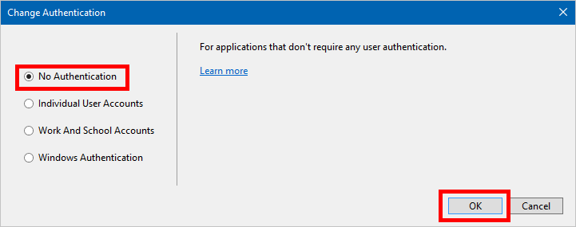
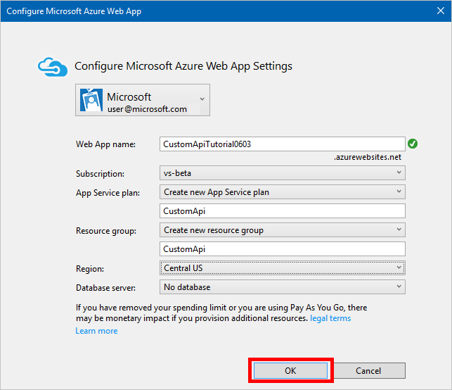
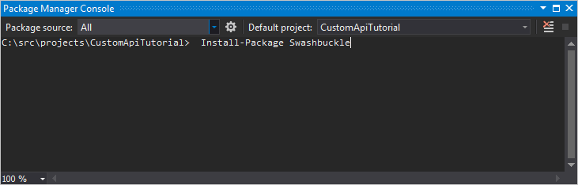

# <a name="build-a-custom-connector-for-a-web-api-in-microsoft-flow"></a>在 Microsoft Flow 中为 Web API 生成自定义连接器
本教程介绍如何先生成 ASP.NET Web API，将其托管到 Azure Web 应用中，启用 Azure Active Directory 身份验证，然后在 Microsoft Flow 中注册 ASP.NET Web API。 注册 API 后，即可连接到该 API 并从流进行调用。 

## <a name="prerequisites"></a>先决条件
* [Azure 订阅](https://azure.microsoft.com/free/)。
* [PowerApps 帐户](https://powerapps.microsoft.com)。
* [Visual Studio](https://www.visualstudio.com/vs/) 2013 或更高版本。

## <a name="create-an-aspnet-web-api-and-deploy-it-to-azure"></a>创建 ASP.NET Web API 并将其部署到 Azure
1. 在 Visual Studio 中单击**“文件”** > **“新建项目”**，创建新的 C# ASP.NET Web 应用程序。
   
    
2. 选择“Web API”模板。  让“在云中托管”保持选中状态。  单击“更改身份验证”。
   
    
3. 选择“不进行身份验证”，然后单击“确定”。
   
    
4. 在“新建 ASP.NET 项目”对话框中单击“确定”。  此时会出现“配置 Microsoft Azure Web 应用”对话框。
   
    ]
   
    选择 Azure 帐户，键入 **Web 应用名称**（或保留默认值），然后选择 Azure **订阅**。  选择或创建**应用服务计划**（订阅中的 Web 应用集合）。  选择或创建**资源组**（订阅中的 Azure 资源组合）。  选择应在其中部署 Web 应用的区域。  如果 Web API 需要，请选择或创建 Azure **数据库服务器**。  最后，单击“确定”。
5. 创建 Web API。
   
   > [!NOTE]
   > 如果还没有准备好 Web API 的代码，请尝试教程：[Getting Started with ASP.NET Web API 2 (C#)](https://www.asp.net/web-api/overview/getting-started-with-aspnet-web-api/tutorial-your-first-web-api)（ASP.NET Web API 2 (C#) 入门）。
   > 
   > 
6. 若要将 Web API 连接到 PowerApps，需要一个描述其操作的 [Swagger](http://swagger.io/) 文件。  可以使用[在线编辑器](http://editor.swagger.io/)编写自己的 OpenAPI，但本教程将使用名为 [Swashbuckle](https://github.com/domaindrivendev/Swashbuckle/blob/master/README.md) 的开源工具。  将 Swashbuckle Nuget 包安装到 Visual Studio 项目中，方法是：单击“工具” > “NuGet 包管理器” > “包管理器控制台”，然后在包管理器控制台中键入 `Install-Package Swashbuckle` 命令。
   
    
   
   > [!TIP]
   > 如果在安装 Swashbuckle 后运行 Web API 应用程序，此时会在 URL `http://<your root URL>/swagger/docs/v1` 中生成 OpenAPI 文件。  `http://<your root URL>/swagger` 中还提供了生成的用户界面。
   > 
   > 
7. 当 Web API 准备就绪以后，即可将其发布到 Azure。 若要从 Visual Studio 发布，请右键单击解决方案资源管理器中的 Web 项目，单击“发布...”，然后按“发布”对话框中的提示操作。
8. 导航到 `https://<azure-webapp-url>/swagger/docs/v1` 即可检索 OpenAPI JSON。  将内容另存为 JSON 文件。  可能需要将文本复制和粘贴到空的文本文件中，具体取决于浏览器。   
   
   > [!IMPORTANT]
   > 操作 ID 重复的 OpenAPI 文档无效。 如果使用的是示例 C# 模板，则操作 ID `Values_Get` 会重复两次。 若要纠正此问题，可将一个实例更改为 `Value_Get`，然后重新发布。
   > 
   > 也可以从本教程下载[示例 OpenAPI](https://pwrappssamples.blob.core.windows.net/samples/webAPI.json)。 在使用之前，请确保删除注释（以 `//` 开头）。
   > 
   > 

## <a name="set-up-azure-active-directory-authentication"></a>设置 Azure Active Directory 身份验证
现在需在 Azure 中创建两个 Azure Active Directory (AAD) 应用程序。  有关如何执行此操作的示例，请参阅 [Azure Resource Manager 教程](customapi-azure-resource-manager-tutorial.md#enable-authentication-in-azure-active-directory)。

> [!IMPORTANT]
> 这两个应用必须位于同一目录中。
> 
> 

### <a name="first-aad-application-securing-the-web-api"></a>第一个 AAD 应用程序：维护 Web API 的安全
第一个 AAD 应用程序用于维护 Web API 的安全。 将其命名为 **webAPI**。  使用以下值执行上述链接的教程步骤（即名为“在 Azure Active Directory 中启用身份验证”的部分）：

* 登录 URL：`https://login.windows.net`
* 答复 URL：`https://<your-root-url>/.auth/login/aad/callback`
* 不需要客户端密钥。
* 不需要委派任何权限。
* **重要！** 请记下应用程序 ID。  以后需要该 ID。

### <a name="second-aad-application-securing-the-custom-connector-and-delegated-access"></a>第二个 AAD 应用程序：维护自定义连接器和委托访问的安全
第二个 AAD 应用程序用于维护自定义连接器注册的安全，并获取对第一个应用程序所保护的 Web API 的委托访问权限。 将此应用程序命名为 **webAPI-customAPI**。

* 登录 URL：`https://login.windows.net`
* 答复 URL：`https://msmanaged-na.consent.azure-apim.net/redirect`
* 添加对 Web API 进行委托访问所需的权限。
* 以后也需要此应用程序的应用程序 ID，因此请记下它。
* 生成客户端密钥，将其存储在某个安全的地方。 以后需要此密钥。

## <a name="add-authentication-to-your-azure-web-app"></a>向 Azure Web 应用添加身份验证
1. 登录到 [Azure 门户](https://portal.azure.com)，然后找到在第一部分部署的 Web 应用。
2. 单击“设置”，然后选择“身份验证/授权”。
3. 启用“应用服务身份验证”，然后选择“Azure Active Directory”。  在下一边栏选项卡中，选择“快速”。  
4. 单击“选择现有的 AD 应用”，然后选择此前创建的 **webAPI** AAD 应用程序。

现在应可使用 AAD 对 Web 应用程序进行身份验证。

## <a name="add-the-custom-connector-to-microsoft-flow"></a>将自定义连接器添加到 Microsoft Flow
1. 修改 OpenAPI，以便添加用于 Web 应用的 `securityDefintions` 对象和 AAD 身份验证。 OpenAPI 的此部分以及 **host** 属性应如下所示：

```javascript
// File header should be above here...

"host": "<your-root-url>",
"schemes": [
    "https"         //Make sure this is https!
],
"securityDefinitions": {
    "AAD": {
        "type": "oauth2",
        "flow": "accessCode",
        "authorizationUrl": "https://login.windows.net/common/oauth2/authorize",
        "tokenUrl" : "https://login.windows.net/common/oauth2/token",
        "scopes": {}
    }
},

// The rest of the OpenAPI follows...
```

1. 浏览到 [Microsoft Flow](https://flow.powerapps.com)，然后根据[在 Microsoft Flow 中注册和使用自定义连接器](register-custom-api.md)一文的说明添加自定义连接器。
2. 上传 OpenAPI 以后，向导会自动检测到你在对 Web API 使用 AAD 身份验证。
3. 配置自定义连接器的 AAD 身份验证。  
   
   * **客户端 ID**：*webAPI-CustomAPI 的客户端 ID*
   * **机密**：*webAPI-CustomAPI 的客户端密钥*
   * **登录 URL**：`https://login.windows.net`
   * **ResourceUri**：*webAPI 的客户端 ID*
4. 单击“创建”创建到自定义连接器的连接。

## <a name="next-steps"></a>后续步骤
了解 [Azure Resource Manager 自定义连接器教程](customapi-azure-resource-manager-tutorial.md)。

