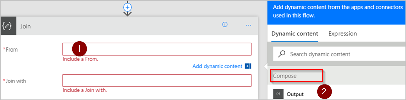

# <a name="use-data-operations-with-microsoft-flow"></a>在 Microsoft Flow 中使用数据操作
本演练介绍 Microsoft Flow 的部分常用数据操作，例如编辑、联接、选择、筛选数组；创建表；分析 JSON。这些操作是在创建流时用来操作数据的。

## <a name="prerequisites"></a>先决条件
* 有权访问 Microsoft Flow。
* [PostMan](https://www.getpostman.com/postman) 之类的工具，用于向流发送带 JSON 数组的 HTTP POST 请求。

## <a name="use-the-compose-action"></a>使用编辑操作
使用“数据操作 - 编辑”（编辑）操作可以在设计流时节省自己的时间，不需多次输入相同的数据。 例如，如果在设计流时需多次输入数组 ````[0,1,2,3,4,5,6,7,8,9]````，则可使用编辑操作来节省数组操作时间，如下所示：

1. 搜索“编辑”，然后选择“数据操作 - 编辑”（编辑）操作。
   
    
2. 将数组输入以后要引用的“输入”框中：
   
    

> [!TIP]
> 为了方便以后引用，请单击“编辑”卡的标题栏上的文本“编辑”，将“编辑”卡重命名。
> 
> 

需要访问编辑操作的内容时，请执行以下步骤，通过“从此流中使用的应用和连接器添加动态内容”列表上的“输出”令牌来操作：

1. 添加一项操作，例如“数据操作 – 联接”。
2. 选择一个控件，以便向其添加在编辑操作中保存的内容。
   
    此时会打开“从此流中使用的应用和连接器添加动态内容”
3. 在“从此流中使用的应用和连接器添加动态内容”上选择“输出”令牌，该令牌位于“动态内容”选项卡的“编辑”类别下。
   
    

## <a name="use-the-join-action"></a>使用联接操作
使用“数据操作 - 联接”操作（联接）可以通过所选分隔符分隔某个数组。 例如，假设流收到一个 Web 请求，其中包括以下电子邮件地址数组：````["d@example.com", "k@example.com", "dal@example.com"]````。 但是，电子邮件程序要求地址是使用分号分隔的单个字符串。 为此，请执行以下步骤，使用“数据操作 - 联接”（联接）操作将逗号分隔符更改为分号“;”：

1. 添加新操作，搜索“联接”，然后选择“数据操作 - 联接”（联接）。
   
    
2. 将数组输入“从”框，然后将要使用的新分隔符输入“联接方式”框。
   
    在这里，使用的是分号 (;) 作为新的分隔符。
   
    
3. 保存并运行流。
4. 流运行后，“数据操作 – 联接”操作的输出将如下所示：
   
    

## <a name="use-the-select-action"></a>使用选择操作
使用“数据操作 – 选择”（选择）可转换数组中对象的形状。 例如，可以添加、删除或重命名数组的每个对象中的元素。

> [!NOTE]
> 可以使用选择操作来添加或删除元素，但不能更改数组中对象的数目。
> 
> 

例如，如果数据通过 Web 请求以下述格式进入流，则可使用选择操作：

````[ { "first": "Deon", "last": "Herb" }, { "first": "K", "last": "Herb" } ]````

你想要改变传入数据，也就是说，将“first”重命名为“FirstName”，将“last”重命名为“LastName”，并添加名为“FamilyName”的新成员，将“first”和“last”组合在一起（使用空格分隔）：

````[ { "FirstName": "Deon", "FamilyName": "Herb", "FullName": "Deon Herb" }, { "FirstName": "K", "FamilyName": "Herb", "FullName": "K Herb" } ]````.

为此，请执行以下操作：

1. 向流添加“请求/响应 – 响应”（请求）操作。
2. 从“请求”卡中选择“使用示例有效负载来生成架构”。
3. 在显示的框中，粘贴源数据数组示例，然后选择“完成”按钮。
4. 添加“数据操作 – 选择”（选择）操作，然后对其进行配置，如下图所示。
   
    
   
   > [!TIP]
   > 选择操作的输出是一个数组，其中包含新成形的对象。 然后即可将该数组用于任何其他操作，例如“编辑”（此前已讨论）。
   > 
   > 

## <a name="use-the-filter-array-action"></a>使用“筛选数组”操作
使用“数据操作 - 筛选数组”（筛选数组），根据所提供的条件来减少数组中的对象数。

> [!NOTE]
> 不能使用“筛选数组”来更改数组中对象的形状。 另外，进行筛选的文本区分大小写。
> 
> 

例如，可以对以下数组使用“筛选数组”：

````[ { "first": "Deon", "last": "Herb" }, { "first": "K", "last": "Herb" } ]````

目的是创建一个新数组，其中只包含“first”设置为“Deon”的对象。

让我们执行此操作。

1. 查找“数据操作 - 筛选数组”（筛选数组）操作，然后将其添加到流。
2. 配置“筛选数组”操作，如下图所示。
   
    
3. 保存并运行流。
   
    可以使用 [PostMan](https://www.getpostman.com/postman) 生成一个向流发送 JSON 数组的 Web 请求。
4. 当流运行以后，假设 JSON 输入如以下数组所示：
   
    ````[ { "first": "Deon", "last": "Herb" }, { "first": "K", "last": "Herb" } ]````,
   
    输出如以下数组所示（注意，仅“first”已设置为“Deon”的对象包括在此操作的输出中）：
   
    ````[ { "first": "Deon", "last": "Herb" } ]````

## <a name="use-the-create-csv-table-action"></a>使用“创建 CSV 表”操作
使用“数据操作 - 创建 CSV 表”（创建 CSV 表）将 JSON 数组输入更改为逗号分隔值 (CSV) 表。 （可选）可以让标头在 CSV 输出中保持可见。 例如，可以使用“创建 CSV 表”操作将以下数组转换为 CSV 表：

````[ { "first": "Deon", "last": "Herb" }, { "first": "K", "last": "Herb" } ]````

1. 查找、添加和配置“数据操作 - 创建 CSV 表”操作，如下图所示。
   
    
   
    注意：此图像中的“正文”令牌来自“请求请求/响应 – 响应”操作，但你可以在流中从任何前述操作的输出获取“创建 CSV 表”操作的输入，也可以直接将其输入“从”框中。
2. 保存并运行流。
   
    流运行时，“创建 CSV 表”输出如下图所示：
   
    

## <a name="use-the-create-html-table-action"></a>使用“创建 HTML 表”操作
使用“数据操作 - 创建 HTML 表”将 JSON 数组输入更改为 HTML 表。 （可选）可以让标头在 HTML 输出中保持可见。

为此，请执行[创建 CSV 表](#use-the-create-csv-table-action)部分中的步骤，以获取详细的示例。 请确保使用“数据操作 - 创建 HTML 表”操作，而不要使用“数据操作 - 创建 CSV 表”操作。

> [!TIP]
> 如果计划通过电子邮件发送 HTML 表，请记住在电子邮件操作中选择“IsHtml”。
> 
> 

