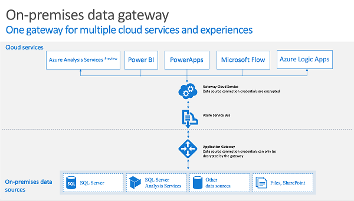

# <a name="understand-on-premises-data-gateways-for-microsoft-flow"></a>了解适用于 Microsoft Flow 的本地数据网关
将本地数据网关与 Microsoft Flow 配合使用，以便安全地连接到本地数据源，例如 Microsoft SQL Server。

## <a name="installation-and-configuration"></a>安装和配置
### <a name="prerequisites"></a>先决条件
最低：

* [.NET Framework 4.6](https://www.microsoft.com/download/details.aspx?id=48130)
* 64 位版本的 Windows 7 或 Windows Server 2008 R2（或更高版本）

建议：

* 8 核 CPU
* 8 GB 内存
* 64 位版本的 Windows Server 2012 R2（或更高版本）

相关注意事项：

* 不能在域控制器上安装网关。
* 不应将网关安装在可能会关闭、休眠或无法连接到 Internet 的计算机（例如笔记本电脑）上。
* 使用无线网络时，网关性能可能会受影响。

## <a name="install-a-gateway"></a>安装网关
> [!IMPORTANT]
> Microsoft SharePoint 数据网关现在支持 HTTP 和 HTTPS 流量。
> 
> 

1. [下载安装程序](https://go.microsoft.com/fwlink/?LinkID=820931)并运行。
   
    
2. 在安装向导的第一个屏幕上选择“下一步”，确认关于在笔记本电脑上安装网关的提醒。
   
    
3. 选择安装位置。
4. 接受使用条款和隐私声明。
5. 选择“安装”。
   
    
6. 在“用户帐户控制”对话框中，选择“是”继续操作。
7. 在“本地数据网关”屏幕上，输入用于登录到网关的帐户的电子邮件地址，选择“登录”，然后完成登录过程。
   
    

## <a name="register-new-gateway-or-take-over-existing-gateway"></a>注册新网关或接管现有网关
1. 选择“在此计算机上注册新网关”或“迁移、还原或接管现有网关”，然后选择“下一步”。
   
    
2. 若要配置新网关，请在“新建本地数据网关名称”框中输入名称，在“恢复密钥”框中输入恢复密钥，在“确认恢复密钥”框中输入同一恢复密钥。 选择“配置”，然后选择“关闭”。
   
    
3. 指定一个至少包含八个字符的恢复密钥，将其保存在安全的地方。 需要此密钥才能迁移、还原或接管相应的网关。
4. 若要迁移、还原或接管现有网关，请提供网关的名称及其恢复密钥，然后选择“配置”，再按其他提示进行操作。
   
    

## <a name="restart-the-gateway"></a>重新启动网关
网关以 Windows 服务的形式运行，与任何其他 Windows 服务一样，可以通过多种方式启动和停止。 例如，可以使用提升的权限，在运行网关的计算机上打开命令提示符，然后运行下述任一命令：

* 若要停止该服务，请运行以下命令：

```batchfile
    net stop PBIEgwService
```

* 若要启动该服务，请运行以下命令：

```batchfile
    net start PBIEgwService
```

## <a name="configure-a-firewall-or-proxy"></a>配置防火墙或代理
若要了解如何为网关提供代理信息，请参阅 [Configure proxy settings](https://powerbi.microsoft.com/documentation/powerbi-gateway-proxy/)（配置代理服务器设置）。

可以在 PowerShell 提示符下运行以下命令，验证防火墙或代理是否会阻止连接。 此命令测试与 Azure 服务总线的连接。 此命令只测试网络连接，不影响云服务器服务或网关。 它用于确定计算机是否已连接到 Internet。

```powershell
Test-NetConnection -ComputerName watchdog.servicebus.windows.net -Port 9350
```

结果应类似于下面的输出。 如果 **TcpTestSucceeded** 不为 true ，则可能已被防火墙阻止。

    ComputerName           : watchdog.servicebus.windows.net
    RemoteAddress          : 70.37.104.240
    RemotePort             : 5672
    InterfaceAlias         : vEthernet (Broadcom NetXtreme Gigabit Ethernet - Virtual Switch)
    SourceAddress          : 10.120.60.105
    PingSucceeded          : False
    PingReplyDetails (RTT) : 0 ms
    TcpTestSucceeded       : True

如果需要详细了解所有情况，可将 **ComputerName** 值和 **Port** 值替换为本主题后面“配置端口”下列出的那些值。

防火墙可能还会阻止 Azure 服务总线发出的到 Azure 数据中心的连接。 如果是这种情况，则需将所在区域的这些数据中心的所有 [IP 地址](https://www.microsoft.com/download/details.aspx?id=41653)列入白名单（即取消阻止）。

## <a name="configure-ports"></a>配置端口
网关可创建到 Azure 服务总线的出站连接。 网关使用以下出站端口进行通信：TCP 443（默认）、5671、5672、9350 至 9354。 网关不需要入站端口。

详细了解[混合解决方案](https://azure.microsoft.com/documentation/articles/service-bus-fundamentals-hybrid-solutions/)。

| 域名 | 出站端口 | 说明 |
| --- | --- | --- |
| *.analysis.windows.net |443 |HTTPS |
| *.login.windows.net |443 |HTTPS |
| *.servicebus.windows.net |5671-5672 |高级消息队列协议 (AMQP) |
| *.servicebus.windows.net |443, 9350-9354 |基于 TCP 的服务总线中继侦听程序（要求使用端口 443 来获取访问控制令牌） |
| *.frontend.clouddatahub.net |443 |HTTPS |
| *.core.windows.net |443 |HTTPS |
| login.microsoftonline.com |443 |HTTPS |
| *.msftncsi.com |443 |无法访问网关时，用于测试 Internet 连接。 |

如果需要将 IP 地址而不是域列入允许列表，可下载并使用 [Microsoft Azure 数据中心 IP 范围列表](https://www.microsoft.com/download/details.aspx?id=41653)。 在某些情况下，Azure 服务总线连接将使用 IP 地址而不是完全限定域名来进行。

## <a name="sign-in-account"></a>登录帐户
用户将使用工作或学校帐户登录。 这是组织帐户。 如果已注册 Office 365 产品/服务，但未提供工作电子邮件，帐户可能会如下所示：nancy@contoso.onmicrosoft.com。用户在云服务中的帐户存储于 Azure Active Directory (AAD) 中的租户内。 在大多数情况下，AAD 帐户的 UPN 将与电子邮件地址匹配。

## <a name="windows-service-account"></a>Windows 服务帐户
本地数据网关配置为使用 NT SERVICE\PBIEgwService 作为 Windows 服务登录凭据。 默认情况下，它有权作为服务登录。 这位于正在安装网关的计算机的上下文中。

这不是用于连接到本地数据源的帐户，也不是登录到云服务的工作或学校帐户。

## <a name="tenant-level-administration"></a>租户级别管理

目前还没有一个单独位置可供租户管理员管理其他用户已安装和配置的所有网关。  如果你是租户管理员，我们建议你让组织中的用户将你添加为他们所安装的每个网关的管理员。 这将允许你通过网关设置页或通过 [PowerShell 命令](https://docs.microsoft.com/power-bi/service-gateway-high-availability-clusters#powershell-support-for-gateway-clusters)管理组织中的所有网关。

## <a name="frequently-asked-questions"></a>常见问题
### <a name="general-questions"></a>常规问题
**问：** 网关支持哪些数据源？
**答：**

* SQL Server
* SharePoint
* Oracle
* Informix
* Filesystem
* DB2

**问：** 是否需要在云（例如 SQL Azure）中为数据源设置网关？
**答：** 否。 网关仅连接到本地数据源。

**问：** 实际的 Windows 服务称为什么？
**答：** 在服务中，网关称为 **Power BI 企业网关服务**。

**问：** 是否可以从云中通过入站连接连接到网关？
**答：** 否。 网关使用出站连接连接到 Azure 服务总线。

**问：** 如果阻止出站连接，该怎么办？ 需要如何才能打开？
**答：** 查看网关使用的[端口](gateway-reference.md#configure-ports)和主机。

**问：** 网关是否必须与数据源安装在同一计算机上？
**答：** 否。 网关将使用提供的连接信息连接到数据源。 在这个意义上，可将网关视为客户端应用程序。 它只需能够连接到提供的服务器名称。

**问：** 从网关运行针对数据源的查询时，延迟情况如何？ 最佳体系结构是什么？
**答：** 为了减少网络延迟，请在安装网关时使之尽可能靠近数据源。 如果将网关安装在实际的数据源上，则可最大程度减少造成的延迟。 另外还需考虑数据中心。 例如，如果服务使用“美国西部”数据中心，而 SQL Server 托管在 Azure VM 中，则需将 Azure VM 也设置在“美国西部”。 这样可最大程度地减少延迟，避免在 Azure VM 上造成传出费用。

**问：** 对网络带宽是否有要求？
**答：** 建议确保网络连接有较高的吞吐量。 每种环境都是不同的，发送的数据量会影响结果。 使用 ExpressRoute 可确保在本地和 Azure 数据中心之间维持一定的吞吐量水平。

可以使用 [Azure 速度测试应用](http://azurespeedtest.azurewebsites.net/)这个第三方工具来确定吞吐量。

**问：** 网关 Windows 服务能否通过 Azure Active Directory 帐户运行？
**答：** 否。 Windows 服务必须使用有效的 Windows 帐户。 默认情况下，它将通过服务 SID *NT SERVICE\PBIEgwService* 运行。

**问：** 如何将结果发送到云？
答：结果使用 Azure 服务总线发送。 有关详细信息，请参阅[工作原理](gateway-reference.md#how-the-gateway-works)。

**问：** 凭据存储在哪里？
答：为数据源输入的凭据加密存储在网关云服务中。 凭据在本地网关中解密。

### <a name="high-availabilitydisaster-recovery"></a>高可用性/灾难恢复
**问：** 是否有任何通过网关启用高可用性方案的计划？
**答：** 此计划仍在筹备之中，尚无日程表。

**问：** 进行灾难恢复时，可以使用哪些选项？
**答：** 可以使用恢复密钥还原或移动网关。

**问：** 恢复密钥的好处是什么？
答：可以使用恢复密钥迁移或恢复网关设置。

### <a name="troubleshooting-questions"></a>故障排除问题
**问：** 网关日志在哪儿？
**答：** 请参阅本主题后面的部[“工具”](gateway-reference.md#tools)分。

**问：** 如何查看要发送到本地数据源的查询？
**答：** 可以启用查询跟踪，其中会包括要发送的查询。 请记住，在完成故障排除后，需要将其更改回原始值。 启用查询跟踪可能会使日志变大。

还可以查看用于跟踪查询的数据源工具。 例如，对于 SQL Server 和 Analysis Services，可以使用扩展事件或 SQL 事件探查器。

## <a name="how-the-gateway-works"></a>网关工作原理


当用户与某个连接到本地数据源的元素交互时：

1. 云服务会创建一个查询，并将查询连同数据源的加密凭据发送到队列供网关处理。
2. 网关云服务会对查询进行分析，将请求推送到 [Azure 服务总线](https://azure.microsoft.com/documentation/services/service-bus/)。
3. 本地数据网关会轮询 Azure 服务总线以获取挂起的请求。
4. 网关会获取查询，解密凭据，然后使用这些凭据连接到数据源。
5. 网关会将查询发送到数据源执行。
6. 结果从数据源发送回网关，然后再发送到云服务。 然后，云服务会使用这些结果。

## <a name="troubleshooting"></a>故障排除
### <a name="update-to-the-latest-version"></a>更新到最新版本
如果网关版本过期，则会浮现出许多问题。 确保使用最新版本。  如果最近未更新网关，请考虑安装最新版本，看能否重现问题。

#### <a name="error-failed-to-add-user-to-group---2147463168---pbiegwservice---performance-log-users---"></a>错误：无法将用户添加到组。  （-2147463168   PBIEgwService   性能日志用户   ）
如果尝试将网关安装在不受支持的域控制器上，则可能会收到此错误。 需将网关安装在不是域控制器的计算机上。

## <a name="tools"></a>工具
### <a name="collecting-logs-from-the-gateway-configurator"></a>从网关配置器收集日志
可以收集网关的多个日志。 始终从日志开始！

1. 安装程序日志
   
    %localappdata%\Temp\On-premises_data_gateway_*.log
2. 配置日志
   
    %localappdata%\Microsoft\on-premises data gateway\GatewayConfigurator*.log
3. 企业网关服务日志
   
    C:\Users\PBIEgwService\AppData\Local\Microsoft\on-premises data gateway\Gateway*.log
4. 事件日志

“本地数据网关服务”事件日志存在于“应用程序和服务日志”下。


### <a name="fiddler-trace"></a>Fiddler 跟踪
[Fiddler](http://www.telerik.com/fiddler) 是 Telerik 提供的一款免费工具，用于监视 HTTP 流量。  可以从客户端计算机通过 Power BI 服务查看来回的流量。 此过程中可能会显示错误以及其他相关信息。

