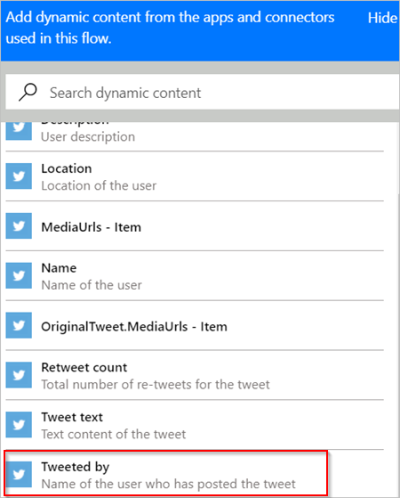

# 在 Microsoft Flow 中创建流

> [!VIDEO https://www.youtube.com/embed/Gt3CMhLAQqE?list=PL8nfc9haGeb55I9wL9QnWyHp3ctU2_ThF]

创建一个流，该流在受到事件触发后自动执行一个或多个任务。 例如，可以创建一个流，在别人发送的推文包含指定的关键字时通过电子邮件通知你。 在此示例中，发送推文是事件，发送邮件是操作。

## 先决条件

* 在 [flow.microsoft.com](https://flow.microsoft.com) 上有一个帐户
* Twitter 帐户
* Office 365 凭据

## 指定一个可启动流的事件

首先需选择通过什么事件或触发器来启动流。

1. 在 [flow.microsoft.com](https://flow.microsoft.com) 的顶部导航栏中选择“我的流”，然后选择“从空白模板开始创建”。

    
1. 在屏幕底部选择“搜索数百个连接和触发器”框，在显示“搜索所有连接和触发器”的框中输入 Twitter，然后选择“Twitter - 粘贴新推文时”。

    

1. 如果尚未将 Twitter 帐户连接到 Microsoft Flow，请选择“登录到 Twitter”，然后提供凭据。

1. 在“搜索文本”框中，键入想要查找的关键字。

    

## 指定操作

1. 选择“新建步骤”，然后选择“添加操作”。

    

1. 在显示“搜索所有连接器和操作”的框中，键入或粘贴“发送电子邮件”，然后选择“Office 365 Outlook - 发送电子邮件”。

    

1. 如果系统提示，请选择登录按钮，然后提供凭据。

1. 在出现的窗体的“收件人”框中，键入或粘贴电子邮件地址，然后从出现的联系人列表中选择名称。

    
1. 在“主题”框中，键入或粘贴“新推文来源:”，然后键入一个空格。

    
1. 在令牌列表中，选择“推送者” 令牌，为其添加一个占位符。

    
1. 选择“正文”框，然后选择“推文文本”令牌，为其添加一个占位符。
1. （可选）在电子邮件的正文中添加更多令牌和/或其他内容。
1. 在屏幕顶部附近，为流命名，然后选择“创建流”。

    
1. 选择“完成”以更新流列表。

     
1. 发送包含指定关键字的推文，或等其他用户发布此类推文。

     推文发布后的一分钟内，电子邮件会通知用户有新推文。

## 管理流

1. 在 [flow.microsoft.com](https://flow.microsoft.com) 的顶部导航栏中选择“我的流”。
1. 在流列表中，执行下列任一操作：

   * 若要暂停流，请将其开关设置为“关闭”。

       
   * 若要恢复流，请将其开关设置为“打开”。 

       
   * 若要编辑流，请选择与要编辑的流相对应的铅笔图标。

       
   * 若要删除流，请先选择“...”图标和“删除”，然后在显示的消息框中选择“删除”。

       
   * 若要查看流的运行历史记录，请从“我的流”页中选择该流，然后在已打开页面的“运行历史记录”部分查看历史记录。

       

     从运行列表中选择流运行，查看每一步的输入和输出。

> [!NOTE]
> 帐户中最多可以有 50 个流。 如果已经有 50 个，则需先删除一个才能创建另一个。
>
>

## 后续步骤

* 向流[添加步骤](multi-step-logic-flow.md)，例如不同的通知方式。
* [按计划运行任务](run-scheduled-tasks.md)：用户需要将操作执行时间设置为每天、特定日期或数分钟后。
* [向应用添加流](https://powerapps.microsoft.com/tutorials/using-logic-flows/)：目的是允许应用在云中启动逻辑。
* [开始使用团队流](create-team-flows.md)并邀请其他人与你协作来设计流。
