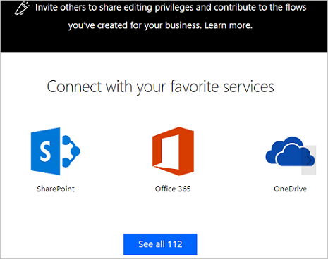
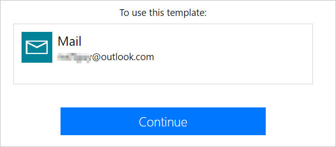

# Microsoft Flow 入门 #

<iframe width="560" height="315" src="https://www.youtube.com/embed/iMteXfAvDSE?list=PL8nfc9haGeb55I9wL9QnWyHp3ctU2_ThF" frameborder="0" allowfullscreen></iframe>

欢迎使用！ Microsoft Flow 是一种可用于在用户最喜欢的应用和服务之间创建自动化工作流的服务，其功能包括同步文件、获取通知、收集数据等。

第一步是[注册](sign-up-sign-in.md)，或者，如果你已经有一个 Microsoft Flow 帐户，则可以在平板电脑、台式电脑，甚至手机上[登录](https://flow.microsoft.com/signin)。

## 查看起始页 ##

在 Microsoft Flow 的[起始页](https://flow.microsoft.com)上，你可以[浏览不同的模板集](https://flow.microsoft.com/templates)，并了解 Microsoft Flow 的关键功能。 用户可以快速了解 Microsoft Flow 的功能及其对公司和个人的用处。

使用 Microsoft Flow，你可以：

- 轻松搜索模板和服务。

    

- 从最常用的服务中进行选择。

    

- 查阅每个流的概述。

    

每个模板都设计有特定的用途。 例如，有可在老板向你发送电子邮件时通过系统向你发送短信的模板、用于将 Twitter 销售线索添加到 Dynamics 365 的模板，或者用于备份文件的模板。 这些模板都只是冰山一角。 它们旨在激发你创建自定义流，以与自己所需的流程完全契合。

## 创建第一个流 ##

1. 选择适用的模板。 [**通过电子邮件获取每日提醒**](https://flow.microsoft.com/galleries/public/templates/45a3399aa29345308f08b6db0a9c85b9/)是一个非常简单的模板：

    

1. 选择“继续”。

    

1. 输入电子邮件地址，以便向其发送每日提醒。 接下来，输入提醒消息。 最后，选择“创建流”，然后验证流是否正常运行。

    

    > [!NOTE]
    > 你可以浏览触发流的条件，以及该事件引发的操作。 调整相关设置，对流进行自定义。 甚至可以添加或删除操作。

1. 选择“完成”。

[遵循本教程](get-started-logic-template.md)以了解有关基于模板创建流的详细信息。

## 发挥创造性 ##

至此，你已经基于模板创建了第一个流，接下来，请使用 Microsoft Flow 所支持的超过 [150 个数据源](https://flow.microsoft.com/connectors/)中的任何数据源，[从头开始创建你自己的流](get-started-logic-flow.md)。

在从头开始创建流时，你将控制整个工作流。 以下是入门的一些建议：

- [包含多个步骤的流](multi-step-logic-flow.md)。
- [按计划运行任务](run-scheduled-tasks.md)。
- [创建审批流](wait-for-approvals.md)。
- [观看运行中的流](see-a-flow-run.md)。
- [发布模板](publish-a-template.md)。

## 使用移动应用 ##

下载适用于 [Android](https://aka.ms/flowmobiledocsandroid)、[iOS](https://aka.ms/flowmobiledocsios) 或 [Windows Phone](https://aka.ms/flowmobilewindows) 的 Microsoft Flow 移动应用。 借助此应用，你可以[监视流活动](mobile-monitor-activity.md)、[管理流](mobile-manage-flows.md)并[基于模板创建流](mobile-create-flow.md)。

## 我们将竭诚为你提供帮助 ##

我们很想了解你可以通过 Microsoft Flow 做些什么，并且希望确保你有一个满意的体验。 如需提问和分享创意，请务必查看我们的[引导式学习](https://flow.microsoft.com/guided-learning/)课程并[加入社区](http://go.microsoft.com/fwlink/?LinkID=787467)。 有问题请[联系支持部门](http://go.microsoft.com/fwlink/?LinkID=787479)。
