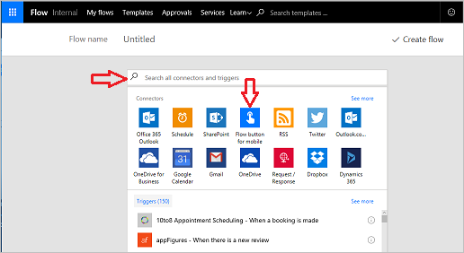
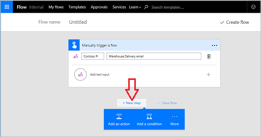
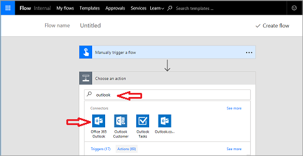
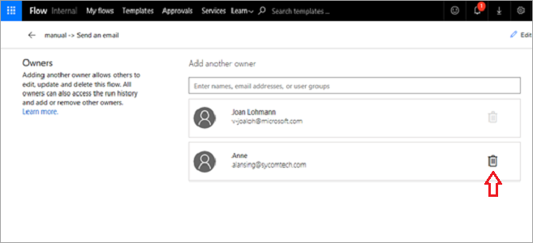

# 创建按钮流
在本主题中，将学习如何为 Contoso Flooring 公司**生成按钮流**。 

按钮流可用于**将电子邮件发送**给团队并**提醒他们要执行的任务**。 流的**所有权****可以分配给一个**工作人员或**由多个团队成员共享**。  

1. 首先，转到 [Microsoft Flow 网站](https://ms.flow.microsoft.com)并登录。
2. 一旦完成登录，请选择“我的流”，然后选择“从空白创建”。
   
    
   
    首先需要触发器。 按钮流是便于使用的触发器。 
3. 如果它没有在列表中，请选择页面底部的“搜索数百个连接器和触发器”，输入“按钮”，然后将弹出触发器。 
4. 选择“适用于移动设备的流按钮”。
   
     
5. 选择“适用于移动设备的流按钮 - 手动触发流”。
   
    
6. 在输入屏幕上，选择“添加输入文本”。
   
    
7. 在第一个文本框中输入“Contoso Flooring”，在第二个文本框中输入“仓库交货电子邮件”。
   
    
8. 选择“新步骤”。 
   
    
9. 选择“添加操作”。 
   
    
10. 选择 **Office 365 Outlook** 连接器。 如果找不到，则搜索 **outlook**。
    
     
11. 选择“Office 365 Outlook - 发送电子邮件”。
    
     
    
     按下按钮时，会将一封电子邮件发送到整个 Contoso 仓库团队，无论他们位于建筑物中的哪个位置，都会让他们知道货物已到达。
12. 展开字段并自定义电子邮件，使其适用于 Contoso Flooring。
    
    1. 在“收件人”字段中，输入组织中的有效电子邮件地址。
    2. 在“主题”字段中，输入“货物到达”。 
    3. 在右侧，请注意弹出的“动态内容”框。 若要在主题行中显示按钮按下时的准确日期和时间，请选择“日期”和“时间戳”。 
       
        
13. 现在，为电子邮件输入一个简单的“正文”，内容类似“仓库团队，请到卸货仓，今天的货物已到达”。
14. 选择“创建流”保存流。
    
     

## 创建团队流
可以使用此按钮流作为如何创建团队流的示例。 如果此流的创建者生病请假怎么办？ 如果她离开了公司怎么办？ 你希望确保此流仍保持运行。 若要做到这一点，请添加共同所有者。

1. 在流上选择**团队图标**以添加共同所有者。
   
     
2. 输入姓名、电子邮件地址或用户组以添加共同所有者。
   
    
3. 若要删除共同所有者，请选择其名称右侧的垃圾桶。
   
    
4. 选择“删除此所有者”完成删除。
   
    

## 摘要
在本课程中，你已了解如何**创建按钮流**。 

在几分钟内，该流使仓库工作人员能够**提醒她的团队****货物到达**，以便团队无需站在那里等待，浪费本来可以用在其他任务上的宝贵时间。 

然后该工作人员与其团队共享该按钮，这样当她不在时，其他人可以触发同一个流。

## 下一课
请查看下一课，了解如何创建使用**推送通知**的流。

