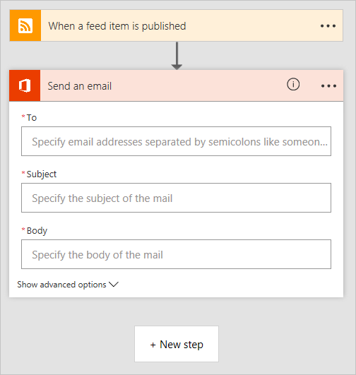

# Microsoft Flow 的构建基块
现在，你已了解 Microsoft Flow 的基本知识，让我们跳转到 **Microsoft Flow 概览**。 我们将快速介绍从模板创建流和从头开始创建流。

## 查看模板
在 flow.microsoft.com 上，如果单击页面顶部的“模板”链接，则将显示几个模板，可以立即对 Web 服务使用这些模板。 浏览这些应用可**快速了解 Microsoft Flow 的功能**及其对业务的帮助。

每个模板流都专用于一个特定用途，例如，在发生事件时收到通知，将新文件从一个服务复制到另一个服务，或跟踪 SharePoint 审批。 这些模板**随时可以使用**。  只需**配置模板**即可将流添加到你的帐户。 可通过执行以下步骤完成此过程：单击“使用此模板”，登录到所需的服务，然后完成随后出现的表格。  例如，这是从模板创建的流，用于在 SharePoint 列表被修改时发送电子邮件通知。 

有数百个模板可供使用，可以在 **Web 版 Microsoft Flow** 或**移动版 Microsoft Flow** 中找到它们。

## 从头开始创建流
你已了解如何使用模板创建流，但如果有一个要自动执行的任务，你却找不到合适的模板，该怎么办？ 可以**从头开始生成流**。  从头开始创建流时，可从一个空白画布开始，然后添加用于构建流的**服务、触发器和操作**。  

## 流的构建基块
不管是通过模板生成流还是从头开始生成流，流都会包含“构建基块”。这些构建基块以特定方式组合在一起，与流程图极其相似。

* **服务**是流中数据的源和目标。
* **触发器**是用于启动流的事件。
* **操作**是由流完成的任务。
* **条件**允许在流中使用分支 if/then 逻辑。
* **循环**用于多次循环执行操作。

### 服务
Microsoft flow 可以连接到许多不同的**应用程序和服务**。  部分示例服务：**Twitter**、**Github**、**Wunderlist**、**Office 365**、**Google Docs**。这些是向 Microsoft Flow 提供数据的**源**，它们也为 Microsoft Flow 完成的工作提供**目标**。  单击 **flow.microsoft.com** 顶部的“服务”链接可查看服务的完整列表。

### 触发器
每个流以**触发器**开头。  有许多不同类型的触发器。  其中一些是连接的 Web 服务中的事件，如**当特定用户发送推文**或**将文件保存到 Dropbox 帐户时**。  其他触发器是内置的，如**按定期计划运行流**或**为响应 Web 请求而运行流**。  最后，还有手动触发器，如通过单击 **Microsoft Flow 或 Microsoft PowerApps 中的按钮**启动流。  触发器通常会向流中的操作**传递有关已发生事件的信息**。

  

### 操作
**操作**表示你希望在触发流后实际**执行**的操作。  这可以是**通知**、**从源将数据或文件复制到目标**或一些其他操作，如**发布到社交媒体**或**延迟一段时间**。  还可以使用操作**从服务中检索数据**以用于其他操作。

 

### 条件
**条件**允许你向流添加判定。  计算条件时，流分支为“是”路径和“否”路径。   例如，如果要将发布到 **Dropbox** 的假期照片复制到 **OneDrive**，可以在“Dropbox 新文件”触发器后创建一个条件检查以查看文件名中是否包含单词“假期”，如果包含，则将文件复制到 **OneDrive**，否则选择不执行任何操作。

 

### 循环
**循环**允许你多次执行某项操作，例如，如果某个操作需要重复执行，或者要对项集合中的每一项都执行一次操作。

## 下一课
在本主题中，我们大致了解了 Microsoft Flow。  我们浏览了**模板**，并谈到了**从头开始创建流**。  我们通过连接到应用和服务来构建流，**触发器**用于启动流，**操作**用于在流中触发某个事件，**条件**用于进行判定，**循环**用于在流中重复执行。  **了解 Microsoft Flow 的最简单方法是从模板开始**，将其连接到已使用的应用和服务。 

接下来，我们将回顾一下目前为止在该引导式学习课程中学到的内容。

