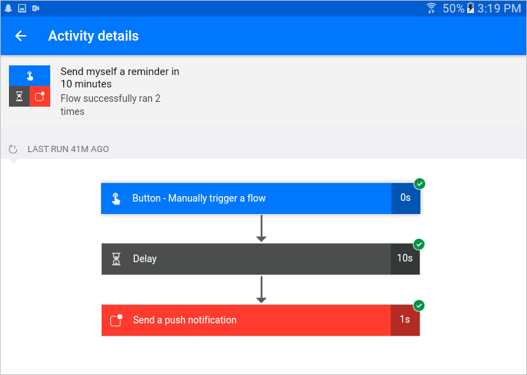

# 使用移动应用管理流
适用于 [Android](https://aka.ms/flowmobiledocsandroid)、[iOS](https://aka.ms/flowmobiledocsios) 或 [Windows Phone](https://aka.ms/flowmobilewindows) 的 Microsoft Flow 移动应用具有与 Web 门户大致相同的功能。

屏幕的底部是**工具栏**，从中可以找到应用的功能。

## 活动
“活动”屏幕显示流的所有活动，包括**运行历史记录**和**通知**。

触摸**运行历史记录**项将向下钻取到**详细日志**，其中显示该流中的哪些步骤**已成功或已失败**。  单击此日志中的步骤将显示**调试信息**，该信息可能在对未按预期运行的流进行**故障排除**时十分有用。

## 浏览
“浏览”屏幕提供用于**搜索**或**浏览**流**模板**的界面。  触摸一个模板将会显示用于完成该模板并创建新流的对话框。 

## 按钮
在“按钮”屏幕中，可以触发包含“按钮 - 手动触发流”触发器的任何流。

## 我的流
“我的流”屏幕列出你的所有流。  触摸一个流将转到“流详细信息”屏幕。

使用“启用流”切换开关可以禁用/启用流而无需删除它。

触摸“编辑流”会转到流设计器以编辑流。

触摸“运行历史记录”将显示流的**运行历史记录**，如同在“活动”屏幕上一样。

触摸“删除流”将删除流。  删除后，流将无法恢复。

## 帐户
使用“帐户”屏幕可以从移动应用中**注销**，并且可以更改当前**环境**。  你还可以找到有关应用和**支持**选项的信息。

## 下一课
我们已了解了两种**管理 Microsoft Flow** 的方法。  现在，我们将复习已在本部分中学习的内容。

