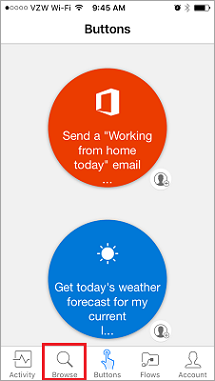
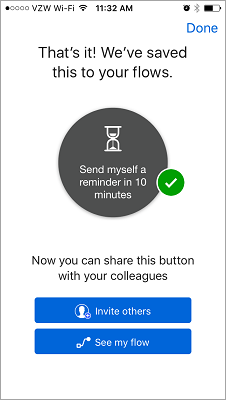

# 使用 Microsoft Flow 移动应用
在本课中，将介绍 Microsoft Flow 移动应用及其功能。 通过移动应用可以访问以下功能：**活动源**、**浏览**、**按钮**和**管理流**。

首先，需要从应用商店**下载****安装** Microsoft Flow 应用。

安装完成后，**打开它**，然后**登录**。 打开应用后，登录**活动源**。

活动源是可在以下情况下查看流所发生情况的一个位置：**在外出**并且可能无法**访问计算机**以获得完整体验时。

例如，如果选择其中一个流，可**详细了解**该流的**上次活动**、其运行成功还是失败，以及失败的具体步骤（如果运行失败）。

如你所见，此流在两个步骤中都成功了。 从此处，继续操作并选择“按钮”图标。

## 如何启动流
   按钮是使用手动操作启动的流。 例如，可以创建“将‘今天在家工作’的电子邮件发送给你的经理”之类的按钮。
如果住得很远，而且那天交通状况很糟，可使用此按钮。

使用“浏览”按钮可查看“更多按钮流”模板是否已添加到集合。

为了查看其工作原理，我们将使用“10 分钟后向我发送提醒”按钮流。

1. 选择“按钮”，然后选择“浏览模板”。
2. 选择提醒按钮流。
3. 点击“使用此模板”。
   
    
4. 点击“创建”。
   
    
   
    流**已保存**。
   
    
5. 点击“按钮”查看新流。 
   
    
6. 继续并点击它，10 分钟后，将**收到提醒**。
   
    

向集合添加其他按钮很容易。

## 修改或删除流
如果决定要修改或删除其中一个流，这很简单。

1. 点击“流”按钮，这实质上是流的移动管理区域。
   
    
2. 现在，点击其中一个流。
   
    
   
    可看到几个选项：
   
   * 若要启用或禁用流，则点击“启用流”切换开关。
   * 如果想要再次使用流，可随时编辑它。 
   * 可查看流的运行历史，了解其成功和不成功的运行。
   * 还可以通过点击“删除流”按钮来删除流。
     
     
     
     在此处，会看到**流已删除**。
     
     

## 下一课
下一课介绍**如何为团队创建按钮流**。 

