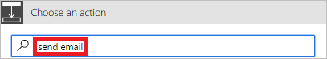

1. 选择该条件的“如果是”分支上的“添加操作”。
   
    
2. 将“发送电子邮件”输入到“选择操作”卡上的搜索框中。
   
    
3. 选择“Office 365 Outlook - 发送电子邮件”操作。
   
    
4. 配置“电子邮件”卡以适合你的需求。
   
     >[!NOTE]
     > “收件人”、“主题”和“正文”是必填字段。
     >
     >
   
     此卡是休假请求状态更改时发送的电子邮件的模板。
   
     注意：在“发送电子邮件”卡上的“正文”框中，请使用来自“审批 - 启动审批”操作的“注释”标记。

