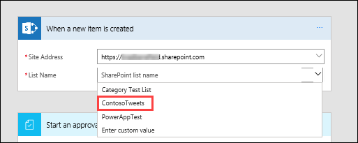
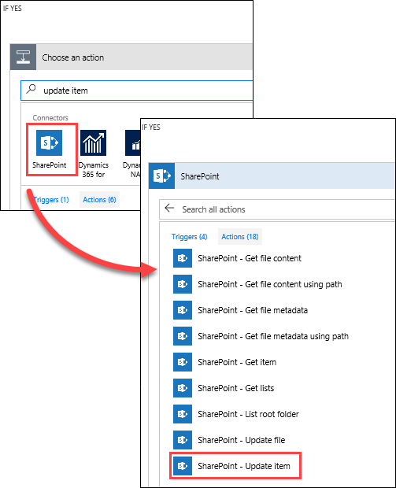

上一主题介绍了如何使用简单的方式通过 SharePoint 列表为 Twitter 源提供支持。 在本主题中，将介绍如何使用审批生成对业务更友好的方案。 这样，任何具有 SharePoint 列表访问权限的人都可以贡献推文，并且社交媒体团队可以批准或拒绝这些推文。 团队保持对帐户和向客户发布的内容的控制。 

## 创建审批申请流
1. 在“Microsoft Flow”主页上，依次选择“审批”、“创建审批流”，然后向下滚动并选择“在批准后向 Twitter 发布列表项”模板。 
   
    
2. 为 **SharePoint**、**审批**和 **Twitter** 验证帐户凭据，然后选择“继续”。 
   
    

默认情况下，每当在特定列表中创建新项时，此模板都会启动一个审批过程，如果该项得到批准，那么它将向 Twitter 发布推文。 在本主题中，将通过添加以下步骤来修改此过程：为 SharePoint 列表更新审批响应，指示它是否已得到批准，并添加审批者可能已添加到提议推文中的任何评论。 

1. 在之前创建的“ContosoTweets”SharePoint 列表中，添加两个新列：
   
   1. 选择加号“**+**”，然后选择“是/否”
   2. 输入 **ApprovalStatus**，然后选择“创建”
   3. 选择加号“**+**”，然后选择“单行文本”
   4. 输入 **ApproverComments**，然后选择“保存”
      
      
2. 回到 **Microsoft Flow**，在**创建新项时**操作中，输入以下值：
   
   * **站点地址**：团队的 SharePoint URL
   * **列表名称**：ContosoTweets
     
     
3. 在**启动审批**操作中，选择“编辑”显示所有字段。 
   
    
4. 在“标题”中，输入“新推文内容”，并从动态内容列表中选择“标题”。 
   
    
5. 在“分配到”中，输入并选择你的姓名或测试用户名。 
   
    
6. 在“详细信息”中，删除默认项并从动态内容列表中添加 **TweetContent**、**TweetDate** 和**由 DisplayName 创建**，由单词 **on** 和 **by** 连接。 
   
    
7. 在“项链接”中，复制并粘贴 SharePoint 列表的 URL，然后在“项链接说明”中输入 **Contoso 推文列表**。 
   
    
8. 在**条件**操作中，悬停在“如果是”框上方，选择加号“**+**”，然后选择“添加操作”。 
   
    
9. 搜索**更新项**，选择“SharePoint”连接器，然后选择“SharePoint - 更新项”操作。
   
    
10. 在“站点地址”和“列表名称”中，再次输入站点 URL 和 **ContosoTweets** 列表，然后在“ID”中，输入动态内容列表中的 **ID**。 
    
     
11. 选择“标题”字段，然后在动态内容列表中搜索**标题**。 添加**当创建新项时**操作中的**标题**项。 
    
     
12. 选择“ApprovalStatus”，然后将值设置为“是”，然后选择“ApproverComments”，并将值设置为动态内容列表中的“评论”。 
    
     
13. 在“如果否，*则不执行任何操作*”框中，选择“添加操作”。
    
     
14. 使用曾用于“如果是”配置的相同步骤，创建“SharePoint - 更新项”操作，除将“ApprovalStatus”设置为“否”以外，使用相同的值配置字段。 
    
     
15. 选择”发布推文“操作，选择“编辑”，并将“推文文本”设置为动态内容列表中的“TweetContent”。  在页面顶部，选择“创建流”保存工作。 
    
     

这只是 Microsoft Flow 提高团队工作效率的方法之一。 团队可以贡献创意、相关资讯或产品指南，你仍然可以对向客户发布哪些推文保持控制。

在我们的下一主题中，我们将查看审批者收到关于提议推文的新申请时的情况。 

