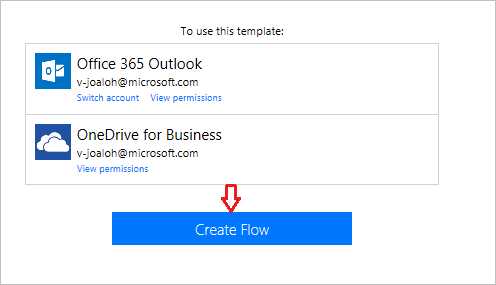
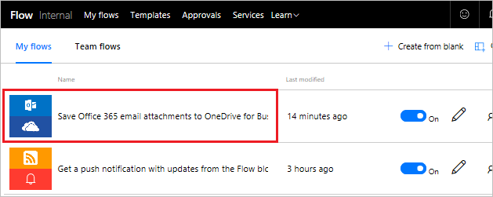

欢迎回到 Microsoft Flow 的引导式学习。 在本课中，你将更深入地了解 Microsoft Flow 环境，并且可以**生成你的第一个流**。

Microsoft Flow 入门很简单，因为有大量的**模板可供选择**，这些模板可帮助你以更有意义的方式连接到已经在使用的服务。  

## Microsoft Flow 模板
看一看 [ Microsoft Flow 网站](https://ms.flow.microsoft.com)，并打开“模板”菜单。 随着在列表中滚动，将看到 Microsoft Flow 支持连接到许多服务。

## 选择模板
通过电子邮件**搜索附件**可能很耗时，此流通过**将所有电子邮件附件存储**到 OneDrive 中的文件夹中来节省时间。

选择“将 Office 365 电子邮件附件保存到 OneDrive for Business”模板。

## 创建和管理流
这是我们的**一键式**模板之一，在这些模板中，只需回答**生成流所必需的**相关问题。

在模板图形上，有一个关于**模板的功能和成功的必备条件**的**说明**。

将要求为 **Office 365 Outlook** 和 **SharePoint** 服务**提供凭据**。 如果定期使用这两种服务，那么已经登录到它们。

1. 选择“创建流”。
   
    
   
    然后将看到结果。 
   
    
   
    流在 OneDrive 上有一个**已创建的文件夹**，它现在将在该文件夹中自动放置发送到工作电子邮件地址的**每个附件**。
2. 打开“我的流”。
   
    
3. 选择“刚刚创建的流”查看它的工作原理。
   
    
4. 将看到一个**绿色复选标记**，指示**流已成功**。 选择“已成功”，查看运行历史记录和结果。
   
    
   
    **流的所有部分**均已成功。 
   
    

## Microsoft Flow 中的重要概念
在生成流时需要知道的一些事项。 每个流都有两个关键部分：**触发器**和**一个或多个操作**。 

可以将**触发器**视为流的起始操作，可以是上述的**收到新电子邮件时**，如果恰巧在使用 SharePoint，则可以是**添加新项时**。 如果使用名为**重复**的触发器，那么它还可以是固定的计划，这将在稍后进行介绍。

操作是希望在**调用触发器时**发生的**活动**。 例如，**创建文件**将在 OneDrive 中重新创建文件。

其他操作可以是发送**电子邮件**、发布**推文**、启动**审批**，等等。
从头开始构建自己的流时，所有这些稍后都将涉及到。 

## 下一课
下一课将介绍 Microsoft Flow 移动应用及其功能。 

