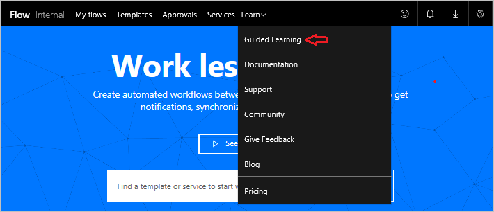

欢迎使用 Microsoft Flow 的引导式学习。 此**自控进度的在线课程**循序渐进地介绍 Microsoft Flow，以便从头开始掌握知识。 本课程旨在提供**划分为几大容易理解的部分的指南**，附带**大量视觉效果和示例**，按照符合逻辑的进程帮助你了解基本原则和细节。

在本课程中，你将了解 Microsoft Flow 及其概念，学习如何在环境中**生成流**、**控制流**和**管理流**。 将展示一家名为 Contoso Flooring 的虚构公司的信息和方案，但也将介绍如何在自己的业务或客户的业务中使用相同的方案。

如果你是 Microsoft Flow 的初学者，本课程将带你入门。 如果你已经具备一些经验，本课程会将概念一一串联，并填补漏洞。 本课程尚未完成，所以请**告诉我们你对我们所做工作的评价**，以及你希望在本课程中想要看到的其他主题。

## Microsoft Flow 是什么？
Microsoft Flow 是一款联机**工作流服务**，可支持通过在大多数最常见的应用和服务上**自动执行工作流**来更智能、更高效地工作。 例如，可以创建一个流，每当具有 100 个以上关注者的人发布与你公司有关的推文时，均可向 **Dynamics 365** 添加潜在客户，在 **MailChimp** 中添加记录。

注册后，可**连接到超过 100 款服务**并**在云或本地源中管理数据**，这些源包括 SharePoint 和 SQL Server 等。 可与 Microsoft Flow 搭配使用的应用程序和服务的数量正在不断增长。

## 使用 Microsoft Flow 可以做什么？
可以使用 Microsoft Flow 在最常用的**应用程序和服务**之间**自动执行工作流**，以便执行同步文件、获取通知、收集数据等操作。 

例如，可以**自动执行**以下任务：

* 立即响应高优先级的通知或电子邮件。
* 赢得、跟踪和跟进新的销售潜在顾客。
* 将文件从一个服务复制到另一个服务。
* 收集关于业务的信息，并与团队共享该信息。
* 自动执行审批工作流。

Microsoft Flow 的一个常见用途是**接收通知**。 例如，每当有销售潜在顾客添加到 Dynamics 365 或 Salesforce 时，可立即在手机上收到电子邮件或推送通知。

还可以**使用 Microsoft Flow 复制文件**。 例如，可以确保添加到 Dropbox 的任何文件都**自动复制**到 SharePoint，方便团队查找。

 

 

可以**监控用户对业务的评价**，方法是创建一个每当**有人发送带有特定井号标签的推文**时都会运行的流。 该流可将关于该推文的详细信息放入 SQL Server 数据库或 SharePoint 列表甚至托管在 OneDrive 上的 Excel 文件，可任意选择合适的服务。 使用收集的数据，可以创建操作来将其连接到 Power BI，发现趋势，并提出有关该数据的问题。

最后，可以针对 SharePoint 列表中的休假申请等用途**自动执行审批循环**。

有关更多想法，请**浏览我们的模板列表**，这些模板有助于通过少量步骤生成流。 例如，可以轻松生成流，用于**向自己发送天气预报**、发送固定间隔的提醒，或者用于在每次经理向你发送邮件时发送手机通知。

对于列表中没有的流，想到了一个创意？ 从头开始创建自己的流，如果你愿意，可以与社区分享！

## 在哪里创建和管理流？
可以在**浏览器中**创建流并执行管理任务，如果下载了 Microsoft Flow 的移动应用，也可以在**手机上**执行这些操作。

  

可以执行包括以下任务在内的许多任务：

* 可以从你所在的任何位置打开或关闭流。
* 查看流何时失败。
* 查看详细的运行历史记录报告。
* 按通知类型查看和筛选运行记录。

## Microsoft Flow 简短浏览
让我们直接介绍这款工具，并带你浏览工具。 关于如何使用 Microsoft Flow，我们有大量信息可供学习。

在主页上，有以下菜单：

* **我的流**，这是流所在的位置。
* **模板**，这是一个很好的起点。
* **审批**，可在此处自动化和简化审批过程。
* **连接器**（原为**服务**），可在此处从一个服务连接到另一个服务。
* **学习**，可在此处获得有助于对 Microsoft Flow 快速入门的信息。

从现在开始，我们专注于**学习**，其中包括：

* **引导式学习**可演练 Microsoft Flow 的使用，从初学技术一直到高级方案。
* **文档**是高级主题所在的位置。 如果要真正了解一个特性或功能，可在此处深入了解，理清头绪。
* **支持**是寻找帮助的好去处。
* **社区**是探究其他人如何使用 Microsoft Flow 的地方。
* **提供反馈**充分利用高级用户社区的力量，可以在此处向开发人员和其他用户**发送评论和问题**。
* **博客**帮助你时刻了解 Microsoft Flow 生态系统中的最新开发和发布。
* **定价**有助于你为自己或业务选择合适的套餐。

在“模板”页面上，可查看某些最热门的模板，应当能为你想要尝试的流提供绝妙的创意。

## 下一课
现在你已初步了解 Microsoft 流是什么以及它可以执行的操作，让我们看一下构成流的元素。

