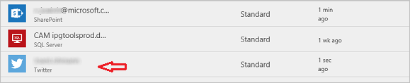
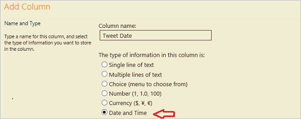

对于此流，将生成 **SharePoint** 列表，**Contoso Flooring** 市场营销团队会将其 **Twitter 帖子**和发布日期存储在该列表中。 在此处，将生成可自动通过推文形式发布内容的流。 

## 连接 Microsoft Flow 服务
在本主题中，将使用 **SharePoint** 和 **Twitter** 服务。 如果对使用的服务不熟悉，首先需要连接到新服务。 

1. 在 Microsoft Flow 中，选择**齿轮图标**，然后选择“连接”，
   
     
2. 选择“+ 创建连接”。
   
     
3. 向下滚动列表，找到 Twitter 并选择“+”。
   
    
4. 若要授权 Twitter 帐户，则输入用户名或电子邮件和密码，然后选择“授权应用”。
   
    
5. 若要检查连接，请选择**齿轮图标**和“连接”。
   
    
   
    应该会看到新的 Twitter 连接和已创建的任何其他连接。 
   
    

## 生成 SharePoint 列表
首先需要为 Contoso Flooring 创建新的 SharePoint Online 列表。 

1. 在 SharePoint Online 中，选择“新建”，然后选择“列表”。
   
    
2. 将列表命名为“Contoso 推文”。 
3. 清除“在站点导航中显示”复选框，然后选择“创建”。
   
    
   
    选择“创建”后，SharePoint 将转至新列表。
4. 默认情况下，列表具有单个列，即“标题”列。 添加另一列并将该列命名为“推文内容”。 推文中所写的内容都将显示在此处。 
   
   1. 选择加号，然后选择“更多...”
      
       
   2. 选择“多行文本”，然后选择“确定”。
      
       
5. 为推文日期和时间添加一列，并将该列命名为“推文日期”。
   
   1. 与上述“推文内容”一样，选择加号，然后选择“更多...”
      
       
   2. 向下滚动到“日期和时间格式”。 选择“日期和时间”，这样两者均包含在内。
      
       
   3. 选择“确定”。 SharePoint 网站中将显示“Contoso 推文”列表，可以向该列表添加新项。

## 生成流
列表已生成，现在便可以生成流。

### 选择触发器
1. 在 Microsoft Flow 中，转到“我的流”，然后选择“从空白创建”。
   
    
2. 选择“在创建项时”。
   
    
   
    我们希望能够在新行添加推文内容时引发触发器。
3. 选择 SharePoint 网站，然后选择前面设置的列表“Contoso 推文”。
   
    

好了，触发器已添加。

### 添加要延迟发布的操作
1. 选择“+ 新步骤”，然后选择“添加操作”。 
   
    
2. 在“日程安排”服务下，选择“延迟截止时间”。 
   
      
3. 设置延迟值。
   
   1. 在“时间戳”字段内单击或点击。 
   2. 当动态内容框打开时，向下滚动到底部，将从 SharePoint 列表看到以下三列：**标题**、**推文日期**和**推文内容**。
   3. 选择“推文日期”。 
      
       
      
       现在，当有人将内容添加到 SharePoint 列表时，会将任何操作延迟到在“推文日期”列中设置的日期和时间。
      
       

### 添加操作以发布推文
现在，为流添加要在“推文日期”列中指定的日期和时间执行的其他操作。

1. 选择“+ 新步骤”、“添加操作”，然后搜索 **Twitter**。
   
     
2. 选择操作“Twitter - 发布推文”。
   
     
3. 在“推文文本”字段内单击或点击，然后在动态内容框中选择“推文内容”。 此处是已创建的序列。 
   
    
4. 选择“创建流...”
   
     
5. 选择“完成”。
   
    
   
    现在流已完成。
   
    
   
    当在 SharePoint 列表中创建新项时，流会将发布延迟到预先设置的日期。 当满足该日期时，流会将列表内“推文内容”列中的文本发布到 Twitter。

## 下一课
在下一课中，将了解如何使用名为“重复”的触发器**按日程安排运行流**。

