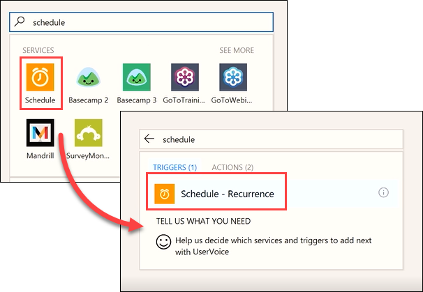
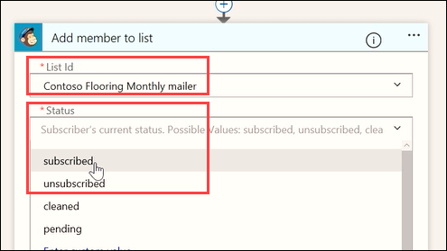
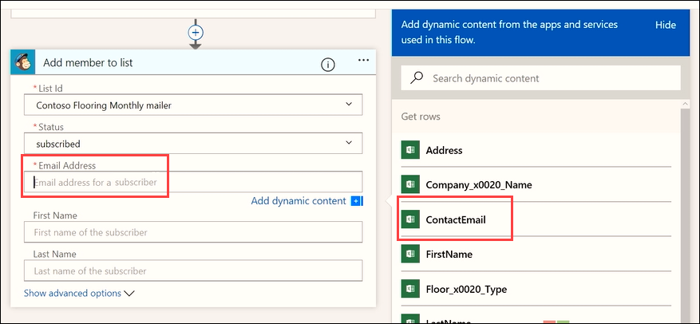

本主题介绍如何使用名为**重复**的触发器运行预先计划的流。  将为 Contoso 市场营销团队生成一个流，用于从 OneDrive 上的 Excel 表中自动拉取客户电子邮件地址。 将该流配置为，已添加到电子表格的新电子邮件地址随后将添加到 MailChimp 客户列表，每天一次。 

## 创建计划流
1. 打开 **Microsoft Flow**，选择“我的流”，然后选择“从空白创建”。 
   
    
2. 选择“搜索数百个连接和触发器”。
3. 搜索**计划**服务，选择该服务，然后选择“计划 - 重复”触发器。
   
    
4. 将“频率”设置为“天”，将“间隔”设置为“1”。 选择“新建步骤”，然后选择“添加操作”。 
   
    
5. 搜索 **Excel**，选择“Excel”服务，然后选择操作“Excel - 获取行”。 
   
    
   
    **请注意**：请确保选择“获取行”，而不是“获取单行”。 
6. 选择**文件名**并导航到你的文件位置。 选择“表名称”，然后在电子表格中选择所需的表。 
   
    
7. 添加新操作。 
   
    
8. 搜索 **MailChimp** 服务，然后选择操作“MailChimp - 将成员添加到列表”。
   
    
   
    **注意：** MailChimp 是*高级*连接器。 根据 Microsoft Flow 许可证，可能需要注册试用版才能使用此连接器。
9. 从下拉菜单中添加“列表 ID”和“状态”字段：
   
   * **列表 ID** - 选择所需的 MailChimp 邮件列表
   * **状态** - 选择“已订阅” 
     
     
10. 在“电子邮件地址”中，使用动态内容功能添加“ContactEmail”字段。 
    
     
    
     请注意，该流自动创建一个额外步骤。 流检测到你打算设置一个需要额外操作的操作。 每当流读取新的电子邮件地址时，它还会为每行创建一个新操作。 
    
     
11. 使用动态内容填充“名”和“姓”字段：
    
    * **名** - FirstName
    * **姓** - LastName
      
      

现在，此流将一天运行一次、从此 Excel 表中获取新行、抓取电子邮件地址和名称，以及使用它们填充 MailChimp Contoso 邮件列表，从而节省时间和金钱。 

