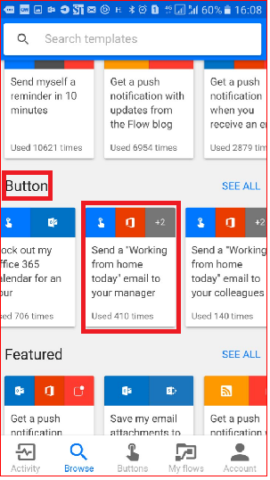
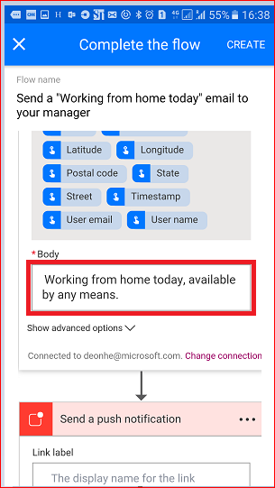

# 按钮触发器令牌入门
## 什么是按钮触发器令牌？
按钮触发器令牌是允许在其上运行[按钮流](introduction-to-button-flows.md)的设备知道并可供其使用的数据点。 这些令牌会根据多种因素（例如当前时间或者设备在给定时刻的地理位置）而变化。  

例如，如果用户在智能手机上运行按钮流，则该手机可能会**知道当前位置的时间**以及日期和当前地址。 在这种情况下，时间、日期以及手机所在的地址都是在按钮流运行时确定的。 这些数据自动供在设备上执行的任何按钮流使用。 用户可以使用这些触发器令牌生成有用的流，以便尽量减少那些重复性任务，例如将地址提供给某人，或者跟踪在特定作业/服务调用上花费的时间。

### 按钮触发器令牌列表
下面是按钮触发器令牌的列表，这些令牌可以在创建按钮流时使用。

| 参数 | 说明 |
| --- | --- |
| 城市 |正在运行流的设备所在的城市。 |
| 国家/地区 |正在运行流的设备所在的国家/地区。 |
| 完整地址 |正在运行流的设备所在位置的完整地址。 |
| 纬度 |正在运行流的设备所在位置的维度。 |
| 经度 |正在运行流的设备所在位置的经度。 |
| 邮政编码 |正在运行流的设备所在位置的邮政编码。 |
| 省/自治区/直辖市 |正在运行流的设备所在的省/自治区/直辖市。 |
| 街道 |正在运行流的设备所在的街道。 |
| 时间戳 |正在运行流的设备所在区域的时间。 |
| 日期 |正在运行流的设备所在区域的日期。 |
| 用户名 |用户登录到正在运行流的设备时所使用的用户名。 |
| 用户电子邮件 |用户登录到正在运行流的设备时所使用的电子邮件地址。 |

## 创建使用触发器令牌的按钮流
创建按钮时，可使用触发器令牌向按钮添加各种功能。

本演练将在 Android 设备上创建一个按钮流。 该按钮流会使用触发器令牌通过“在家工作”电子邮件将日期和你的完整地址发送给你的老板。

本演练显示的是 Android 设备的屏幕截图，但在 iOS 和 Windows Phone 设备上的体验是类似的。

### 先决条件
* 一个有权访问 Microsoft Flow 的工作或学校电子邮件地址或 [Microsoft 帐户](https://account.microsoft.com/about?refd=www.microsoft.com)。
* 适用于 [Android](https://aka.ms/flowmobiledocsandroid)、[iOS](https://aka.ms/flowmobiledocsios) 或 [Windows Phone](https://aka.ms/flowmobilewindows) 的 Microsoft Flow 移动应用。

开始操作：

1. 启动 Flow 并选择“浏览”   
     
2. 在“按钮”类别下选择“向经理发送‘今天在家工作’电子邮件”服务   
     
3. 选择“使用此模板”  
     
4. 在“发送电子邮件”卡上选择“编辑”  
     
5. 点击“主题”文本框，然后将“今天 - ”输入文本框中，位于“WFH”文本之后。 请注意，在点击文本框时，也打开了一个参数/令牌的列表。 我们会在下一步使用其中一个令牌将日期添加到电子邮件主题中。  
     
6. 光标仍在主题文本框中，此时可滚动到参数的“手动”列表，然后点击“日期”。 请注意，此时日期参数位于“主题”文本框中：  
     
7. 滚动到“正文”文本框，在默认消息后点击，以便在其中添加其他令牌。  
     
8. 点击“完整地址”参数，然后点击“创建”  
     
9. 点击“完成”。 按钮流现在已创建。  
     

## 运行按钮流
**注意**：此按钮流会通过电子邮件发送你的当前位置。  

1. 点击屏幕底部的“按钮”类别。 此时会显示用户有权使用的按钮的列表。 点击代表刚创建的按钮流的那个按钮：  
     
2. 点击“允许”，允许按钮流访问设备的位置信息：  
     
3. 你会注意到，电子邮件很快就发送给了你的老板：  
     

恭喜！你刚创建了一个使用日期和完整地址触发器令牌的按钮流。 

## 后续步骤
* [共享按钮流](share-buttons.md)
* [了解按钮流](introduction-to-button-flows.md)  
* [了解流](guided-learning/get-started.yml?tutorial-step=1)

