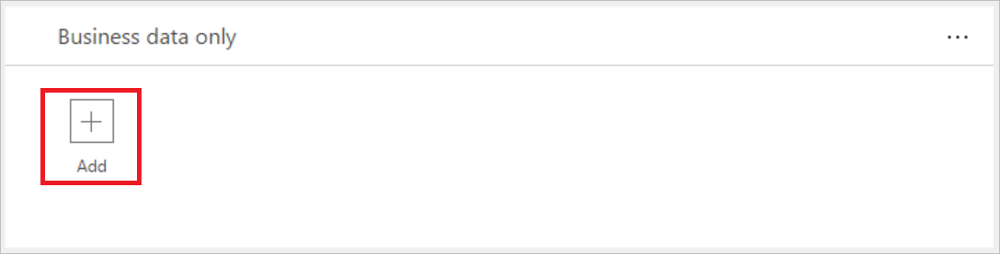

# 全面了解数据组
## 什么是数据组？
数据组是在[数据丢失防护 (DLP) 策略](prevent-data-loss.md)中对服务进行分类的一种简单方法。 可用的两个数据组为“仅限业务数据”组和“不允许业务数据”组。 组织可以自由决定将哪些服务划分到特定数据组。 对服务进行分类的一个好方法是根据服务对组织的影响将它们划分成组。 默认情况下，所有服务都划分到“不允许业务数据”数据组。 可以通过从管理中心创建或修改 DLP 策略的属性，来管理数据组中的服务。

## 数据组之间如何共享数据
位于不同组中的服务之间不能共享数据。 例如，如果将 SharePoint 和 Salesforce 划分到“仅限业务数据”组，并将 Facebook 和 Twitter 划分到“不允许业务数据”组，则不能创建在 SharePoint 和 Facebook 之间移动数据的流。 尽管不能在不同组中的服务之间共享数据，但可以在特定组内的服务之间共享数据。 因此，让我们回到前面的示例，由于将 SharePoint 和 Salesforce 划分到同一个数据组，最终用户创建的流可以在 SharePoint 与 Salesforce 之间共享数据。 同样，最终用户可以创建在 Facebook 和 Twitter 之间共享数据的流和 PowerApps。 要点是特定组中的服务可以共享数据，而不同组中的服务不能共享数据。  

此外，还必须将一个数据组指定为默认组。 最初，“不允许业务数据”组是默认组，所有服务都在该数据组中。 管理员可以将默认数据组更改为“仅限业务数据”数据组。 **注意** 添加到流的任何新服务都将划分到指定的默认组。 出于此原因，建议你将“不允许业务数据”保留为默认组，并在组织评估了允许与新服务共享业务数据的影响后手动将服务添加到“仅限业务数据”组。

## 将服务添加到数据组
在本演练中，我们会将 SharePoint 和 Salesforce 添加到数据丢失防护 (DLP) 策略的“仅限业务数据”数据组。 

1. 选择 DLP 策略的“仅限业务数据”分组框中的“+添加”链接：    
     
2. 选择 SharePoint 和 Salesforce，然后选择“添加服务”，将这两项添加到“仅限业务数据”组：    
     
3. 从顶部菜单中选择“保存策略”：  
    
4. 请注意，SharePoint 和 Salesforce 现在已在“仅限业务数据”组中：  
      

在本演练中，已将 SharePoint 和 Salesforce 添加到 DLP 策略的“仅限业务数据”数据组。 如果属于 DLP 策略环境的某人创建了一个应用，该应用在 SharePoint 或 Salesforce 与“不允许业务数据”数据组中的任何服务之间共享数据，则不会允许该应用运行。

## 从数据组中删除服务
由于所有服务都必须在某一可用数据组，若要从特定组中删除某个服务，只需将该服务添加到另一个组，然后保存策略即可。  

## 更改默认数据组
在本演练中，我们会将默认数据组从“不允许业务数据”数据组更改为“仅限业务数据”数据组。  

**重要信息** 添加到流的任何新服务都将划分到指定的默认组。 出于此原因，建议你将“不允许业务数据”保留为默认组，并手动将服务添加到“仅限业务数据”组。

1. 对于要指定为默认数据组的数据组，选择其右上角的“...”：    
     
2. 选择“设为默认组”：  
      
3. 从顶部菜单中选择“保存策略”：  
    
4. 请注意，该数据组现在已指定为默认数据组：  
      

## 后续步骤
* [了解有关数据丢失防护 (DLP) 策略的详细信息](prevent-data-loss.md)
* [了解有关环境的详细信息](environments-overview-admin.md)   

