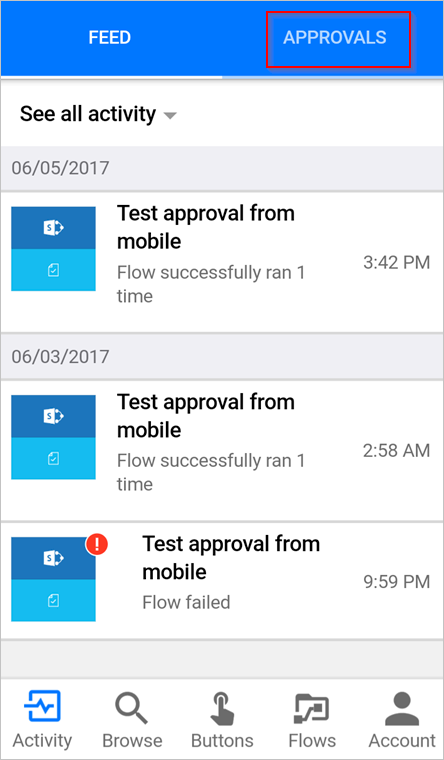

# 在移动设备上使用 Microsoft Flow 审批请求
如果某个流将你标识为审批者，并且你已安装用于 Microsoft Flow 的移动应用，则每当系统请求你进行审批时，你就会收到推送通知。

本文演示了几个常见的情形，当你在用于 Microsoft Flow 的移动应用中管理审批请求时，可能会遇到这些情形。

> [!NOTE]
> 本主题中的图片来自 Android 设备，但 iOS 上的体验是类似的。
> 
> 

## 先决条件
若要完成本演练，你需要：

* 一个运行用于 Microsoft Flow 的移动应用的 [Android](https://aka.ms/flowmobiledocsandroid) 或 [iOS](https://aka.ms/flowmobiledocsios) 设备。
* 被指定为审批流中的审批者。
* 待审批的请求。

## 查看待处理的请求
1. 打开用于 Microsoft Flow 的移动应用。
   
    
2. 选择右上角的“审批”。
   
    
3. 查看所有挂起的审批：
   
    

如果没有任何待审批请求，请创建一个[审批流](modern-approvals.md)，将自己设置为审批者，然后触发该流。 在该流触发并发送待审批请求后数秒钟，审批请求就会出现在审批中心。

## 审批请求并根据需要留下注释
1. 如果尚未这样做，请按照上述步骤[查看挂起的请求](mobile-approvals.md#view-pending-requests)。
2. 在要批准的请求上选择“批准”。
   
    
3. （可选）选择“添加注释(可选)”。
   
    
   
    在“添加注释”屏幕上输入注释。
   
    
4. 在右上角选择“确认”。
   
    
   
    流记录你的决策后，会显示成功屏幕。
   
    

## 拒绝请求并根据需要留下注释
执行[审批请求的步骤](mobile-approvals.md#approve-requests-and-leave-an-optional-comment)，但在第二步选择“拒绝”。

## 了解详情
[创建新式审批流](modern-approvals.md)。

