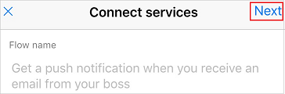

# 使用 Microsoft Flow 通过手机创建流
在手机中通过模板创建流，而模板则可通过搜索服务列表、浏览各种类别或指定关键字来查找。 按本主题所述步骤创建一个流，在收到经理的邮件后向手机发送推送通知。

如果不熟悉 Microsoft Flow，请[阅读概述](getting-started.md)。

## 先决条件
* [Microsoft Flow 帐户](sign-up-sign-in.md)。
* [支持的设备](getting-started.md#use-the-mobile-app)上适用于 [Android](https://aka.ms/flowmobiledocsandroid)、[iOS](https://aka.ms/flowmobiledocsios) 或 [Windows Phone](https://aka.ms/flowmobilewindows) 的 Microsoft Flow 移动应用。 本主题的图片反映的是 iPhone 版应用，但 Android 设备或 Windows Phone 上的界面是类似的。
* 若要使用本主题中演示的模板，还需具备以下条件：
  
  * Office 365 凭据。
  * 在手机上启用推送通知。

## 查找模板
1. 打开移动应用，然后点击屏幕底部的“浏览”。
   
    
   
    可以通过以下任意方式查找模板：
   
   * 在屏幕顶部的搜索框中指定关键字。
   * 点击服务列表中的选项。
   * 通过向下滚动显示各种类别，然后点击任意类别中的模板。
     
       
     
     本教程需打开相关模板，在收到经理的邮件时通过系统发送推送通知。
2. 在服务列表中，点击“全部查看”。
   
    
3. 点击“推送通知”图标。
   
    
4. 在搜索栏中键入“电子邮件”，然后点击模板，在收到经理的邮件时通过系统发送推送通知。
   
    
5. 在详细说明所选模板的屏幕中，点击“使用此模板”。
   
    

## 完成流
1. 在提示时点击“登录”，提供适用于 Office 365 Outlook 和/或 Office 365 用户的凭据。
   
    
   
    创建其他流时，可以使用相同的连接。
2. 在右上角点击“下一步”。
   
    
   
    下一屏幕显示触发器事件以及所有引发的操作。
   
    
   
    就此模板来说，新邮件会触发流，该流会检索用户信息（包括用户经理的地址），在用户收到该地址发送的邮件时，通过系统向用户发送推送通知。 某些模板需要某种程度的自定义才能正常使用，但此模板不需要。
3. （可选）在屏幕顶部附近，为流键入其他名称。
   
    
4. 在右上角点击“创建”。
   
    
   
    流已创建，并且会查看用户经理发送给用户的邮件，除非用户暂停或删除此流。

## 后续步骤
* [监视流活动](mobile-monitor-activity.md)。
* [管理流](mobile-manage-flows.md)。

