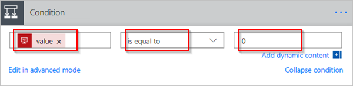

# 使用 Microsoft Flow 筛选和复制数据
本演练介绍如何创建一个流，用于监视源中新建或更改的项，然后将这些更改复制到目标。 如果用户在一个位置输入数据，但团队需要在另一个位置或以另一种格式获得该数据，则可以创建此类流。

尽管本演练将数据从 Microsoft SharePoint [列表](https://support.office.com/article/SharePoint-lists-I-An-introduction-f11cd5fe-bc87-4f9e-9bfe-bbd87a22a194)（源）复制到 [Azure SQL 数据库](https://docs.microsoft.com/azure/sql-database/sql-database-technical-overview)表（目标），但在 Microsoft Flow 支持的超过 [150 种服务](https://flow.microsoft.com/connectors/)之间均可以复制数据。

> [!IMPORTANT]
> 在目标中所做的更改不会复制到源，因为不支持双向同步。 如果尝试设置双向同步，会创建一个无限循环，在源和目标之间无休止地发送更改。
> 
> 

## 先决条件
* 对数据源和目标的访问权限。 本演练不包括创建源和目标的步骤。
* 有权访问 [Microsoft Flow](https://flow.microsoft.com)。
* 大致了解如何存储数据。
* 熟悉创建流的基础知识。 可以查看如何添加[操作、触发器](multi-step-logic-flow.md#add-another-action)和[条件](add-condition.md)。 以下步骤假设用户了解如何执行这些操作。

> [!TIP]
> 并非源和目标中的每个列名称都需要匹配，但必须在插入或更新项时为所有*必需的*列提供数据。 Microsoft Flow 标识所需的字段。
> 
> 

## 步骤的简要概述
如果熟悉 Microsoft Flow，可使用以下快速步骤将数据从数据源复制到另一个数据源：

1. 标识要监视的源和要将更改的数据复制到的目标。 确认拥有两者的访问权限。
2. 标识至少一个可唯一标识源和目标中的项的列。 在以下示例中，我们使用“标题”列，但也可以使用任何想要的列。
3. 设置用于监视源中的更改的触发器。
4. 搜索目标以确定是否存在已更改的项。
5. 按如下方式使用**条件**：
   * 如果目标中不存在新建或更改的项，则创建它。
   * 如果目标中存在新建或更改的项，则更新它。
6. 触发流，然后确认新建或更改的项正在从源复制到目标。

> [!NOTE]
> 如果之前未创建与 SharePoint 或 Azure SQL 数据库的连接，请在收到登录提示时按照说明进行操作。
> 
> 

下面是创建该流的详细步骤。

## 监视源中的更改
1. 登录到 [Microsoft Flow](https://flow.microsoft.com)，依次选择“我的流” > “从空白创建”。
2. 搜索 **SharePoint**，然后从触发器列表中选择“SharePoint - 当创建或修改项时”。
3. 输入**站点地址**，然后选择“当创建或修改项时”卡上的“列表名称”。
   
    为流监视新建或更新项的 SharePoint 列表提供**站点地址**和**列表名称**。
   
    

## 搜索目标中新建或更改的项
我们使用 **SQL Server - 获取行**操作搜索目标中新建或更改的项。

1. 选择“新建步骤” > “添加操作”。
2. 搜索**获取行**，选择“SQL Server - 获取行”，然后从“表名称”列表中选择要监视的表。
3. 选择“显示高级选项”。
4. 在“筛选器查询”框中，输入 **Title eq '**，从动态内容列表中选择“标题”令牌，然后输入 **'**。
   
    上一步假设要将源和目标中的行标题匹配。
   
    “获取行”卡的外观现在应如此图片所示：
   
    

## 检查是否找到了新建或更改的项
依次选择“新步骤” > “添加条件”来打开“条件”卡。

在“条件”卡上：

1. 选中左侧的框。
   
    此时会打开“从此流中使用的应用和连接器添加动态内容”列表。
2. 从“获取行”类别中选择“值”。
   
   > [!TIP]
   > 确认已从“获取行”类别中选择“值”。 不要从“当创建或修改项时”类别中选择“值”。
   > 
   > 
3. 从中央框中的列表中选择“等于”。
4. 在右侧的框中输入 **0**（零）。
   
    “条件”卡现在类似于下图：
   
    
5. 选择“在高级模式中进行编辑”。
   
    高级模式打开时，你可在框中看到 \@equals(body('Get_rows')?['value'], 0) 表达式。 通过围绕 **body('Get_items')?['value']** 函数添加 **length()** 来编辑此表达式。 整个表达式现在显示如下：**@equals(length(body('Get_rows')?['value']), 0)**
   
    “条件”卡现在类似于下图：
   
    
   
   > [!TIP]
   > 添加 **length()** 函数可使流检查“值”列表，并确定它是否包含任何项。
   > 
   > 

当流从目标中“获取”项时，有两种可能的结果。

| 结果 | 下一步 |
| --- | --- |
| 项存在 |[更新该项](odata-filters.md#update-the-item-in-the-destination) |
| 项不存在 |[创建新项](odata-filters.md#create-the-item-in-the-destination) |

> [!NOTE]
> 下面显示的“插入行”和“更新行”卡的图像可能与实际外观有所不同，因为这些卡显示在流中使用的 Azure SQL 数据库表中的列名称。
> 
> 

## 在目标中创建该项
如果目标中不存在该项，则使用 **SQL Server - 插入行**操作创建它。

在“条件”的“如果是”分支上：

1. 选择“添加操作”，搜索“插入行”，然后选择“SQL Server - 插入行”。
   
    将打开“插入行”卡。
2. 从“表名称”列表中，选择将插入新建项的表。
   
    “插入行”卡将展开并显示选定表中的所有字段。 带有星号 (*) 的字段是必填字段，必须填充才能使行生效。
3. 选择要填充的每个字段，并输入数据。
   
    可以手动输入数据，从“动态内容”中选择一个或多个令牌，或者在字段中输入文本和令牌的任意组合。
   
    “插入行”卡现在类似于下图：
   
    

## 在目标中更新该项
如果目标中存在该项，则更新其更改。

1. 将 **SQL Server - 更新行**操作添加到“条件”的“如果否”分支。
2. 按照此文档的[创建项](odata-filters.md#create-the-item-in-the-destination)部分中的步骤填充表中的字段。
   
    
3. 在页面顶部，在“流名称”框中输入流名称，然后选择“创建流”来保存它。
   
    

现在，每当 SharePoint 列表（源）中的项发生更改时，流都会触发，并在 Azure SQL 数据库（目标）中插入新项或更新现有项。

> [!NOTE]
> 当从源中删除项时，不会触发流。 如果这是一个重要方案，请考虑添加一个单独的列，用于指示何时不再需要项。
> 
> 

## 了解详情
在流中使用[数据操作](data-operations.md)。

