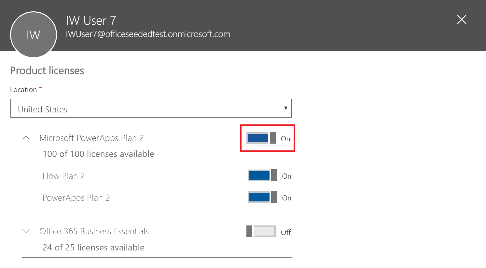

# 用户组织中的 Microsoft Flow 问题与解答
本主题介绍组织中的用户如何使用 Microsoft Flow，以及用户如何控制 Microsoft Flow 服务。

## 注册 Flow
### Microsoft Flow 是什么？
Microsoft Flow 是一种公有云服务，用于帮助个人和团队在其常用的应用和服务之间设置自动化工作流，以便执行同步、获取通知、收集数据等。 

### 用户如何注册 Flow？
个人用户可以使用两种方法，通过 Web 门户注册 Flow：

#### 选项 1
任何人都可以访问 [flow.microsoft.com](https://flow.microsoft.com)，选择“免费注册”，然后通过 [portal.office.com](https://portal.office.com/Start?sku=flow_free) 或 [signup.live.com](https://signup.live.com) 完成注册过程。

#### 选项 2
任何人都可以访问 [flow.microsoft.com](https://flow.microsoft.com)，选择“登录”，使用其工作、学校或个人电子邮件登录，然后接受 Flow 使用条款来完成注册。    

当组织中的某个用户使用选项 2 注册 Flow 时，系统会自动为该用户分配一个 Microsoft Flow 免费版许可证。

[注册 Flow](sign-up-sign-in.md) 提供了更多详细信息。

### 我可以阻止其他人注册 Flow 吗？
Microsoft Flow 是完全公有的云服务，世界上的任何人都可以注册并使用它来自动完成日常任务。 用户不需要拥有或者使用 Office 365 帐户即可使用 Microsoft Flow。 因此，目前没有任何机制阻止另一个人使用 Flow（因为世界上的任何人都可以使用 Flow，不管其电子邮件地址如何）。

但是，如果某人注册 Microsoft Flow，并且你选择在你的组织内不支持他们，那么他们无法导致对你的公司收取费用。 当个人注册 Microsoft Flow 时，就会在该人与 Microsoft 之间建立一种关系，就像 Microsoft 推出的许多其他云服务（例如必应、Wunderlist、OneDrive 或 Outlook.com）一样。个人使用 Microsoft Flow 并不意味着该服务由你的组织提供。

最后，如果你的公司想要在 Microsoft Flow 内限制使用仅限组织使用的数据，则可通过数据丢失防护 (DLP) 策略来实现。

### 用户如何获得 Microsoft Flow 付费功能的访问权限？
个人可以通过三种方式获得 Microsoft Flow 付费功能的访问权限：

1. 他们可以分别注册 Flow 计划 1 或 Flow 计划 2 试用版免费试用 90 天
2. 你可以在 Office 365 管理门户中为他们分配 Flow 许可证。
3. 该用户已被分配了 Office 365 和 Dynamics 365 计划，这些计划包括对 Flow 服务的访问权限。 请参阅 [Flow 定价页](https://flow.microsoft.com/pricing/)以查看包括 Flow 功能的 Office 365 和 Dynamics 365 计划的列表。

### 我可以阻止其他人使用 Flow 的付费功能吗？
任何个人可以试用 Microsoft Flow 的付费功能 90 天，这不会产生任何费用。 但是，你可以通过 Office 365 管理门户来全面管理组织内的永久付费许可证分配。

与免费的产品/服务一样，如果个人选择注册试用版，那么这是个人和 Microsoft 之间存在的直接关系，不必经过你的公司认可。

## Flow 的管理
### 为什么 Flow 图标出现在 Office 365 应用启动器中？
如 8 月份公告的那样，Microsoft Flow 现在是 Office 365 套件的基本部分。 在此公告之后的三个月，Microsoft Flow 已作为所有现有 Office 365 SKU 的一部分以服务形式启用。 由于全世界各地的用户现在都可以使用 Microsoft Flow，因此它已出现在该应用启动器中。

如果希望默认情况下从应用启动器中删除 Flow 磁贴，请参阅下一部分。

### 如何为我的组织从应用启动器中删除 Microsoft Flow？
如果用户被分配了 Flow 计划 1 或 Flow 计划 2 许可证，你可以执行以下步骤删除该用户的 Flow 许可证，这将从应用启动器中删除 Flow 图标：

1. 访问 [Office 365 管理门户](https://portal.microsoftonline.com/)。
2. 在左侧的导航栏中，选择“用户”，然后选择“活动用户”。
3. 找到你想要删除其许可证的用户，然后选择其名称。
4. 在用户详细信息窗格中的“产品许可证”部分中，选择“编辑”。
5. 找到名为“Microsoft Flow 计划 1”或“Microsoft Flow 计划 2”的许可证，将开关设置为“关”，然后选择“保存”。
   
   

如果用户具有通过其 Office 365 和 Dynamics 365 计划许可证访问 Flow 的权限，你可以通过执行以下步骤来禁用他们对此计划中包含的其他功能的访问权限：

1. 访问 [Office 365 管理门户](https://portal.microsoftonline.com/)。
2. 在左侧的导航栏中，选择“用户”，然后选择“活动用户”。
3. 找到你想要删除其访问权限的用户，然后选择其名称。
4. 在用户详细信息窗格中的“产品许可证”部分中，选择“编辑”。
5. 展开用户的 Office 365 或 Dynamics 365 许可证，禁用对名为“用于 Office 365 的 Flow”或“用于 Dynamics 365 的 Flow”的服务的访问权限，然后选择“保存”。
   
   

还可以通过 PowerShell 批量删除许可证。 请参阅[使用 Office 365 PowerShell 从用户帐户中删除许可证](https://technet.microsoft.com/library/dn771774.aspx)了解详细示例。   最后，有关批量删除许可证内服务的进一步指导，请参阅[使用 Office 365 PowerShell 禁用对服务的访问权限](https://technet.microsoft.com/library/dn771769.aspx)。

删除组织中用户的 Flow 许可证或服务将导致为该用户从以下位置删除 Flow 图标：

1. [Office.com](https://office.com)
   
   
2. Office 365 应用启动器
   
   

请注意，默认情况下这只会删除 Flow 磁贴。 用户仍可以选择以个人身份使用 Microsoft Flow。

### 为何我的 Office 365 租户中出现了 10000 个 Microsoft Flow 许可证？
任何人都可以试用 Microsoft Flow 计划 1 或 2 90 天，并且这些试用版许可证表示你租户中的新 Flow 用户的可用容量。 对于这些许可证，不会收取任何费用。 具体而言，你看到 Office 365 管理门户中出现容量为 10000 个的 Flow（试用版）许可证的可能原因有两个：

1. 如果你的租户中至少有一个用户参与了从 2016 年 4 月到 2016 年 10 月的 Flow 公开预览，那么你将看到标为“Microsoft PowerApps 和逻辑流”的 10000 个许可证。
   
    
2. 如果你的租户中至少有一个用户通过[用户如何注册 PowerApps](#how-do-people-sign-up-for-flow) 部分中概述的试用版注册“选项 1”注册了 Flow 计划 2 试用版，那么你将看到标为“Microsoft Power Apps 和 Flow”的 10000 个许可证。
   
    

可以选择自行通过 Office 365 管理门户将更多许可证分配给用户，但请注意，这些是 Microsoft Flow 计划 2 的试用版许可证，它们将在分配给用户 90 天后过期。

### 该服务是免费的吗？ 这些许可证是否收费？
未经你明确同意，没有任何用户可以导致对你的组织收取费用，因此免费版和试用版许可证均不能导致对你的组织收取任何费用。 此外，它们也不会使用任何配额，例如运行配额。

### 我删除了 Microsoft Flow 免费版许可证，但用户仍然可以访问 Flow？
包含 Microsoft Flow 免费版许可证只是用于跟踪目的。 根据第一部分中的介绍，禁止其他人将 Microsoft Flow 用于个人用途是不可能的。 因此，提供 Microsoft Flow 免费版许可证不会实际授予或删除任何功能。

### 为何在 Office 365 管理门户中看不到所有 Flow 许可证？
用户可以以个人身份或组织成员身份使用 Microsoft Flow。 组织级别的许可证在 Office 365 门户中始终可见。 但是，如果用户以个人身份注册试用版，则其许可证不由 Office 365 管理员管理，因此不会显示在门户中。

### 个人如何确定其所使用的套餐？
若要查看所使用的套餐，可访问 Flow 定价页：[https://flow.microsoft.com/pricing](https://flow.microsoft.com/pricing)。 其中会显示个人当前使用的套餐或试用版的情况。

### Microsoft Flow 注册是否会影响我的组织中的标识？
如果组织已有 Office 365 环境，并且组织中的所有用户都有 Office 365 帐户，则标识管理不会受到影响。

如果组织已有 Office 365 环境，但组织中并非每个用户都有 Office 365 帐户，则我们会在租户中创建一个用户，并根据该用户的工作或学校电子邮件地址分配许可证。 这意味着，随着组织中的用户不断注册该服务，在任意特定时间管理的用户数也会不断增加。

如果组织中没有任何 Office 365 环境连接到你的电子邮件域，则标识的管理方式不会发生变化。 用户将添加到新的仅限云的用户目录，你可以使用相应的选项充当租户管理员的角色，然后管理这些用户。

### Microsoft Flow 创建了新租户，我应如何管理此租户？
如果 Microsoft Flow 创建了一个新租户，你可以使用以下步骤声明和管理该租户：

1. 使用与所要管理的租户域匹配的电子邮件地址域注册 Flow，从而加入该租户。 例如，如果 Microsoft 创建了 contoso.com 租户，则使用以 @contoso.com 结尾的电子邮件地址加入该租户。
2. 通过验证域所有权来声明管理员控制权：加入租户后，可以通过验证域所有权，将自己提升为管理员角色。 为此，请执行以下步骤：    
   
   1. 转到 [https://portal.office.com](https://portal.office.com/Start?sku=flow_free)。
   2. 选择左上角的应用启动器图标，然后选择“管理员”。
   3. 阅读“成为管理员”页上的说明，然后选择“是，我想成为管理员”。  
      
       **注意**：如果此选项未显示，则表示目前已有一个 Office 365 管理员。

### 如果我有多个域，是否可以控制用户添加到的 Office 365 租户？
如果你未采取任何措施，系统将为每个用户电子邮件域和子域创建一个租户。

如果希望所有用户都在同一个租户中，而不管他们的电子邮件地址扩展名为何：  

* 提前创建目标租户，或使用现有租户。 在该租户中添加想要合并的所有现有域和子域。 然后，电子邮件地址以这些域和子域结尾的所有用户在注册时会自动加入该域。

**重要说明**：创建租户后，没有任何受支持的自动化机制可以跨租户移动用户。 若要了解如何将域添加到单个 Office 365 租户，请参阅 [Add your users and domain to Office 365](https://support.office.com/article/Add-your-users-and-domain-to-Office-365-ffdb2216-330d-4d73-832b-3e31bcb5b2a7)（将用户和域添加到 Office 365）。

### 如何限制用户访问我的组织的业务数据？
Microsoft Flow 允许为业务数据和非业务数据创建数据区，如下所示。 实施这些数据丢失防护策略后，用户会被禁止设计或运行将业务数据和非业务数据混合的流。 有关详细信息，请参阅[数据丢失防护 (DLP) 策略](prevent-data-loss.md)。

  

