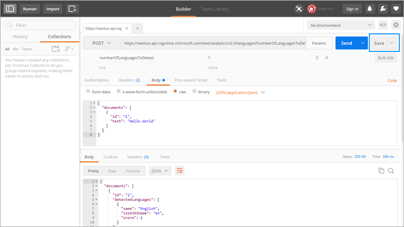
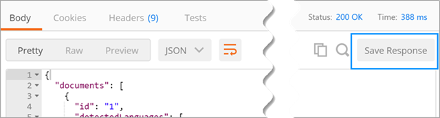

# 介绍 Postman 的自定义连接器
[Postman](https://www.getpostman.com/) 是一项工具，可以加快 API 开发速度，降低其难度。 本教程介绍如何创建 Postman Collection，以便用其在 Microsoft Flow 中轻松创建[自定义连接器](register-custom-api.md)。

## 先决条件
* 安装 [Postman 应用](https://www.getpostman.com/apps)。

## 创建 Postman Collection
让我们针对 Azure 认知服务[文本分析 API](https://www.microsoft.com/cognitive-services/text-analytics-api) 生成一个 Postman Collection。 该 API 标识你传递给它的文本中的语言、情绪和关键短语。

1. 创建 Postman Collection 的第一步是创建请求。 创建请求时，可以设置 HTTP 谓词、请求 URL、查询或路径参数、标头和正文。 有关详细信息，请参阅 Postman 文档中的 [Sending Requests](https://www.getpostman.com/docs/requests)（发送请求）。 对于“检测语言 API”终结点，请将值设置如下：
   
    
   
    所使用参数和值的详细信息：
   
   | 参数 | 值 |
   | --- | --- |
   | 谓词 |POST |
   | 请求 URL |https://westus.api.cognitive.microsoft.com/text/analytics/v2.0/languages |
   | 参数 |numberOfLanguagesToDetect |
   | 授权 |“No Auth” |
   | 标头 |Ocp-Apim-Subscription-Key = <your subscription key>  Content-Type = application/json |
   | 正文 |<code>{ &nbsp;&nbsp;&nbsp;"documents": [ &nbsp;&nbsp;&nbsp;&nbsp;&nbsp;{ &nbsp;&nbsp;&nbsp;&nbsp;&nbsp;&nbsp;&nbsp;&nbsp;"id": "1", &nbsp;&nbsp;&nbsp;&nbsp;&nbsp;&nbsp;&nbsp;&nbsp;"text": "Hello World" &nbsp;&nbsp;&nbsp;&nbsp;&nbsp;} &nbsp;&nbsp;] }<code> |
2. 单击“发送”进行请求并取回响应。
3. 单击“保存”将请求保存到 Postman Collection 中。
   
    
4. 在“保存请求”对话框中提供“请求名称”和“请求说明”。 将在自定义连接器中使用这些值。
   
    
   
    也可保存对请求的响应。 自定义连接器目前仅支持一个请求一个响应。 如果为一个请求保存多个响应，则仅使用第一个响应。
   
    
5. 通过创建和保存其他请求和响应，继续生成 Postman Collection。
6. 为所有请求和响应生成 Postman Collection 以后，请导出该集合。
   
    
7. 选择“Collection v1”作为导出格式。
   
    

现在可以使用此 Postman Collection 在 Microsoft Flow 中创建自定义连接器。

> [!IMPORTANT]
> 从 Postman 集合创建自定义连接器时，请确保从操作和触发器中删除 `Content-type` 标头，因为 Microsoft Flow 会自动添加该标头。 身份验证标头（例如 `Ocp-Apim-Subscription-Key`）应在 Security 节中定义，且必须从操作和触发器中删除。 
> 
> 

有关详细信息，请参阅[在 Microsoft Flow 中注册和使用自定义连接器](register-custom-api.md)。

