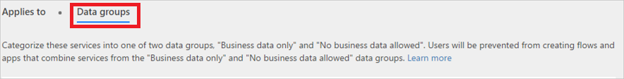
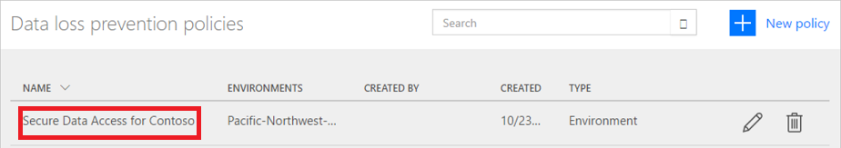

# 数据丢失防护 (DLP) 策略

本文档介绍数据丢失防护策略，这些策略有助于防止组织数据与定义的连接器列表共享。

## 什么是数据丢失防护策略？

组织的数据是取得成功的关键所在。 组织的数据需要随时可用于决策，但必须受到保护，避免与无权访问这些数据的受众共享。 为了保护这些数据，Microsoft Flow 提供了创建和实施策略的功能，用于定义可访问和共享业务数据的客户连接器。 这些定义如何共享数据的策略称为数据丢失防护 (DLP) 策略。

## 为何要创建 DLP 策略？

创建 DLP 策略可以明确定义可访问和共享业务数据的客户连接器。 例如，使用 Microsoft Flow 的组织可能不希望在 SharePoint 中的业务数据自动发布到其 Twitter 源。 为了防止出现这种情况，请创建 DLP 策略，阻止将 SharePoint 数据用作推文来源。

## DLP 策略的优点

* 确保在整个组织中以统一的方式管理数据。
* 防止将重要业务数据意外发布到社交媒体站点等连接器。

## 管理 DLP 策略

### 管理 DLP 策略的先决条件

* 拥有环境管理员或租户管理员权限。

    可在[环境文章](environments-overview-admin.md)中了解有关权限的详细信息。
* [Microsoft Flow P2 许可证](billing-questions.md)。

## 创建 DLP 策略

### 创建 DLP 策略的先决条件

若要创建 DLP 策略，必须至少对一个环境拥有相应的权限。

请按照以下步骤创建 DLP 策略，以防止公司的 SharePoint 站点中的数据发布到 Twitter：

1. 登录到 [Microsoft Flow 管理中心](https://admin.flow.microsoft.com)（管理中心）。

1. 选择“数据策略”选项卡，然后选择“新建策略”链接：

    
1. 选择“数据组”选项卡：

1. 在页面顶部的“数据策略名称”标签中，输入“Contoso 的安全数据访问”作为 DLP 策略名称：

    

1. 在“环境”选项卡中选择“[环境](environments-overview-admin.md)”。

    > [!NOTE]
    > 环境管理员可以创建仅应用到单个环境的策略。 租户管理员可以创建仅应用到任何环境组合的策略：
    >
    >

    

1. 选择“数据组”选项卡：

    

1. 选择“仅业务数据”分组框中的“添加”链接：

    

1. 从“添加连接器”页中选择“SharePoint”和“Salesforce”连接器：

   

1. 选择“添加连接器”按钮以添加可共享业务数据的连接器。

1. 选择屏幕右上角的“保存策略”。

1. 片刻之后，新 DLP 策略将显示在数据丢失防护策略列表中：

    

1. **（可选）**向团队发送一封电子邮件或其他通讯，提醒他们有新的 DLP 策略可用。

祝贺你，你现已创建一个允许应用在 SharePoint 与 Salesforce 之间共享数据，并阻止与其他任何服务共享数据的 DLP 策略。

> [!NOTE]
> 将服务添加到一个数据组会自动将该服务从其他数据组中删除。 例如，如果 Twitter 当前位于“仅业务数据”数据组，并且你不希望允许与 Twitter 共享业务数据，则只需将 Twitter 服务添加到“不允许业务数据”数据组。 这将从“仅业务数据”数据组中删除 Twitter。
>
>

## 数据共享冲突

假定已创建上述 DLP 策略，如果某个用户创建的流在 Salesforce（位于“仅业务数据”数据组中）与 Twitter（位于“不允许业务数据”组中）之间共享数据，系统会通知该用户该流“已暂停”，因为这与已创建的防数据丢失策略冲突。

如果用户因流暂停而与你联系，需考虑下述事项：

1. 在此示例中，如果因正当业务原因而需要在 SharePoint 和 Twitter 之间共享业务数据，则可编辑 DLP 策略。

1. 要求用户按 DLP 策略编辑流。

1. 要求用户在决定是否在这两个实体之间共享数据之前，让流保持“已暂停”状态。

## 查找 DLP 策略

### 管理员

管理员可以从管理中心使用搜索功能查找特定的 DLP 策略。

> [!NOTE]
> 管理员应该发布所有 DLP 策略，以便组织中的用户在创建流之前，意识到存在这些策略。
>
>

### 创建者

如果你没有管理员权限并想要详细了解组织中的 DLP 策略，请与管理员联系。 也可以通过[创建者环境文章](environments-overview-maker.md)了解详细信息

> [!NOTE]
> 只有管理员可以编辑或删除 DLP 策略。
>
>

## 编辑 DLP 策略

1. 启动[管理员中心](https://admin.flow.microsoft.com)。

1. 在启动的管理中心内，选择左侧的“数据策略”链接。

    

1. 搜索现有 DLP 策略的列表，选择要编辑的策略旁边的编辑按钮。

1. 对策略进行必要的更改。 例如，可以修改环境或者数据组中的服务。

1. 选择“保存策略”保存所做的更改。

> [!NOTE]
> 环境管理员可以查看租户管理员创建的 DLP 策略，但无法编辑这些策略。
>
>

## 删除 DLP 策略

1. 启动[管理员中心](https://admin.flow.microsoft.com)。

1. 选择左侧的“数据策略”选项卡。

    

1. 搜索现有 DLP 策略的列表，然后选择要删除的策略旁边的删除按钮：

    

1. 选择“删除”按钮，确认你确实想要删除该策略：

    

## DLP 策略权限

只有租户管理员与环境管理员可以创建和修改 DLP 策略。 在[环境](environments-overview-admin.md)文章中了解有关权限的详细信息。

## 后续步骤

* [了解有关环境的详细信息](environments-overview-admin.md)
* [了解有关 Microsoft Flow 的详细信息](getting-started.md)
* [了解有关管理中心的详细信息](admin-center-introduction.md)
* [了解有关数据集成的详细信息](https://docs.microsoft.com/common-data-service/entity-reference/dynamics-365-integration)
