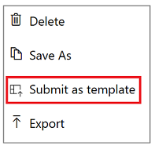

# 向 Microsoft Flow 库提交模板
向 Microsoft Flow 的模板库提交流模板。 模板不仅方便用户创建流，而且有助于用户设计更多利用流的方案。 

1. 在“我的流”页上，选择与某个流相对应的省略号 (...)。
   
    
2. 在出现的菜单中，选择“作为模板提交”。
   
    
3. 指定有意义的标题，明确说明可以借助模板来自动执行的方案，并指定适用于模板的类别。
   
    
4. 选择“提交”。
   
     Microsoft Flow 团队会对模板进行验证，并且可能会修改模板。 如果该团队批准了你的模板，该模板会显示在 Microsoft Flow 的模板库中。

