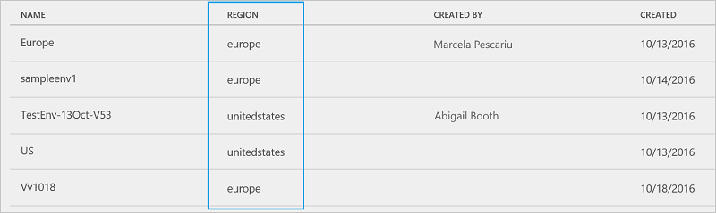

# 有关 Microsoft Flow 中的区域的常见问题
本文档提供有关 Microsoft Flow 的常见问题列表。

## 如何查明流部署在哪里？
流部署在托管[环境](environments-overview-admin.md)的[区域](https://azure.microsoft.com/regions/)中。 例如，如果环境是在欧洲区域创建的，则流部署在欧洲数据中心。

如果管理员登录到 Microsoft Flow [管理中心](https://admin.flow.microsoft.com)，那么他们可以识别该区域。 “环境”选项卡列出所有现有环境及其区域。

## 可以使用哪些区域？
* 美国
* 欧洲
* 亚洲
* 澳大利亚
* 印度
* 日本
* 加拿大

## 哪些功能特定于某个给定区域？
可以在不同区域创建环境并将其绑定到该地理位置。 在环境中创建流时，此流会部署到该地理位置的数据中心。 这适用于在该环境中创建的任何项目，包括通用数据模型、流、连接、网关、应用和自定义连接器。

为了优化性能，请在最靠近用户的区域创建环境。 例如，如果用户位于欧洲，则在欧洲区域创建环境。 如果用户位于美国，则在美国区域创建环境。

## 网关
网关具有以下特点：

* 不可用于印度区域。
* 仅在默认环境中受支持，不在自定义环境中受支持。

## Microsoft Flow 在国家/地区云中是否可用？
Microsoft Flow 在国家/地区云中不可用。 我们已计划在 2018 年支持国家/地区云。

## 每个区域使用什么出站 IP 地址？
请参阅[限制和配置](limits-and-config.md)。

