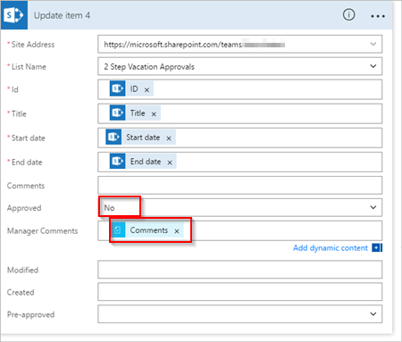

# 使用 Microsoft Flow 管理顺序审批
有些工作流需要在最后审批者签署之前得到预先批准。 例如，一个公司可能有一个顺序审批策略，在得到财务部门批准之前，需要预先批准超过 1000.00 美元的发票。

在本演练中，我们将创建一个顺序审批流，用于管理员工休假请求。

## 流中的详细步骤
流：

1. 当员工在 [SharePoint Online 列表](https://support.office.com/article/Introduction-to-lists-0a1c3ace-def0-44af-b225-cfa8d92c52d7)中创建休假请求时启动。
2. 将休假请求添加到审批中心，并通过电子邮件将请求发送给预审批者。
3. 将预先批准决策通过电子邮件发送给员工。
4. 使用预审批者决策和注释来更新 SharePoint Online 列表。
   
   注意：如果预先批准请求，该流将继续执行以下步骤：
5. 将请求发送给最后审批者。
6. 将最终决策通过电子邮件发送给员工。
7. 使用最终决策更新 SharePoint 列表。

此图总结了前面的步骤：

   

## 先决条件
[!INCLUDE [prerequisites-for-modern-approvals](includes/prerequisites-for-modern-approvals.md)]

你创建的 SharePoint Online 列表必须包含以下列：

   

请记下 SharePoint Online 列表的名称和 URL。 稍后在配置“SharePoint - 当创建新项时”触发器时，我们将使用这些项。

## 从空白模板创建流
[!INCLUDE [sign-in-and-create-flow-from-blank-template](includes/sign-in-and-create-flow-from-blank-template.md)]

## 添加触发器
[!INCLUDE [add-trigger-when-sharepoint-item-created](includes/add-trigger-when-sharepoint-item-created.md)]

   

## 获取创建休假请求的人员的管理器。
[!INCLUDE [add-get-manager-action](includes/add-get-manager-action.md)]

1. 为你的流提供一个名称，然后选择“创建流”保存目前为止已进行的工作。
   
    
   
   > [!NOTE]
   > 定期从屏幕顶部选择“更新流”以将更改保存到流。
   > 
   > 
   
    

在执行每个保存操作后，选择屏幕顶部的“编辑流”，然后继续进行更改。

## 添加审批操作以用于预先审批
[!INCLUDE [add-an-approval-action](includes/add-an-approval-action.md)]

注意：此操作会将预先审批请求发送到“分配到”框中的电子邮件地址。

## 添加条件
[!INCLUDE [add-approval-condition-response](includes/add-approval-condition-response.md)]

> [!NOTE]
> 此条件从“启动审批”操作检查响应。
> 
> 

## 添加电子邮件操作以用于预先审批
[!INCLUDE [add-action-to-send-email-when-vacation-approved](includes/add-action-to-send-email-when-vacation-approved.md)]

   

## 添加更新操作以用于预先批准请求
[!INCLUDE [add-action-to-update-sharepoint-with-approval](includes/add-action-to-update-sharepoint-with-approval.md)]

   

## 获取预审批者的管理器
1. 使用我们前面的[获取创建休假请求的人员的管理器](sequential-modern-approvals.md#get-the-manager-for-the-person-who-created-the-vacation-request)步骤来添加并配置另一个“获取管理器”操作。 这次我们将获取预审批者的管理器。
2. 完成后，“获取管理器 2”卡应类似于下图。 请务必使用“从此流中使用的应用和服务中添加动态内容”卡上”获取管理器”类别中的“电子邮件”令牌。
   
   

## 添加最后审批操作
1. 使用前面执行的[添加审批操作以用于预先审批](sequential-modern-approvals.md#add-an-approval-action-for-pre-approvals)步骤来添加并配置另一个“启动审批”操作。 此操作将发送电子邮件请求以进行最后审批。
2. 完成后，卡应类似于下图：
   
    

## 添加最后审批条件
1. 重复[添加条件](sequential-modern-approvals.md#add-a-condition)中的步骤，以添加并配置查看最后审批者决策的条件。

## 发送最终审批电子邮件
1. 使用[添加电子邮件操作以用于预先审批](sequential-modern-approvals.md#add-an-email-action-for-pre-approvals)中的步骤添加并配置一个操作，以在休假请求得到批准后发送电子邮件。
2. 完成后，你的卡应类似于下图：
   
   

## 使用审批更新 SharePoint
1. 使用[添加更新操作以用于预先批准请求](sequential-modern-approvals.md#add-an-update-action-for-pre-approved-requests)中的步骤添加并将配置一个操作，以在休假请求得到批准后更新 SharePoint。
2. 完成后，卡应类似于下图：
   
    

## 发送预先批准拒绝电子邮件
[!INCLUDE [add-action-to-send-email-when-vacation-rejected](includes/add-action-to-send-email-when-vacation-rejected.md)]

   

注意：此操作必须添加到“条件”卡下的“如果否，则不执行任何操作”分支。

## 使用预先批准拒绝更新 SharePoint
[!INCLUDE [add-action-to-update-sharepoint-with-rejection](includes/add-action-to-update-sharepoint-with-rejection.md)]

   

## 发送最终拒绝电子邮件
1. 使用[发送预先批准拒绝电子邮件](sequential-modern-approvals.md#send-email-with-pre-approval-rejection)中的步骤添加并配置一个操作，以在最后审批者拒绝休假请求时发送电子邮件。
   
    注意：此操作必须添加到“条件 2”卡下的“如果否，则不执行任何操作”分支。
2. 完成后，卡应类似于下图：
   
   

## 使用最终拒绝更新 SharePoint
1. 使用[使用预先审批拒绝更新 SharePoint](sequential-modern-approvals.md#update-sharepoint-with-pre-approval-rejection) 中的步骤添加并配置一个操作，以在最后审批者拒绝休假请求时更新 SharePoint。
2. 完成后，卡应类似于下图：
   
   
3. 选择“更新流”以保存已完成的工作。
   
   

如果已按照上述步骤执行操作，流应类似于下图：

现在我们已经创建流，我们来看看它的实际效果。

## 请求批准
[!INCLUDE [request-vacation-approval](includes/request-vacation-approval.md)]

请求应类似于此图像：

## 查看待审批请求
[!INCLUDE [view-pending-approvals](includes/view-pending-approvals.md)]

## 预先批准请求
[!INCLUDE [approve-request-from-different-locations](includes/approve-request-from-different-locations.md)]

## 批准请求
批准请求的步骤与[预先批准请求](sequential-modern-approvals.md#pre-approve-a-request)的步骤相同

注意：最后审批者只有在请求得到预先批准后才能获取休假请求。

## 拒绝请求
[!INCLUDE [reject-a-request](includes/reject-a-request.md)]

## 详细信息
[单个审批者现代审批演练](modern-approvals.md)

