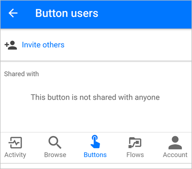

# 在 Microsoft Flow 中共享按钮流
在 Microsoft Flow 移动应用中，可与组织内的其他用户或组共享[按钮流](introduction-to-button-flows.md)（按钮）。 共享某个按钮时，与之共享的个人或组可以运行该按钮，就像其运行自己的按钮一样。 还可以[共享链接](share-buttons.md#re-share-a-button)，该链接指向其他人与你共享的按钮。 可以随时[停止共享](share-buttons.md#stop-sharing-a-button)按钮。

> 本文档中使用的屏幕截图是从 Android 设备截取的。 如果使用 iPhone，则图像的显示可能有所不同，但功能是相同的。
> 
> 

请按[这些步骤](share-buttons.md#use-shared-buttons)使用他人与你共享的按钮。

## 先决条件
若要共享按钮，需满足以下条件：

* 帐户有权访问 [Microsoft Flow](https://flow.microsoft.com)。
* 可以共享某个流。
* 一个移动设备，装有适用于 [Android](https://aka.ms/flowmobiledocsandroid)、[iOS](https://aka.ms/flowmobiledocsios) 或 [Windows Phone](https://aka.ms/flowmobilewindows) 的 Microsoft Flow 移动应用。
* 组织中存在可以与之共享按钮的组或用户。

## 共享按钮
可以从 Microsoft Flow 移动应用的“按钮”选项卡共享按钮。

1. 点击要共享的按钮旁边的小图标。
   
    
2. 从“按钮用户”页点击“邀请他人”。
   
    
3. 搜索并选择要与之共享按钮的组或个人。
   
    
4. 在“邀请他人”页上点击“发送”。
   
    
5. 点击页面上的“完成”（指示按钮共享操作已成功完成）。
   
    

## 要求用户使用其自己的连接
> [!NOTE]
> 共享按钮时，可允许与之共享按钮的人使用该按钮所使用的所有连接。 还可以要求他们使用自己的连接。 如果允许其他人使用你的连接，则他们无法访问连接中的凭据，也无法在任何其他流中重复使用它们。
> 
> 

按照这些步骤要求与之共享按钮的人使用自己的连接。

1. 在共享按钮后显示的屏幕上，选择“管理连接”。
2. 在要管理的按钮上选择“编辑”。
3. 选择“由用户提供”或自己的电子邮件地址。
   
    该选择将指示必须在共享的按钮中使用谁的连接。
   
    
   
    可以随时查看或更改选择。 若要更改，请在要管理的按钮上依次选择“流”选项卡>“已共享的流”>“用户和连接”>“连接”选项卡>“编辑”。
   
    

## 查看按钮用户的列表
从“按钮”选项卡执行以下步骤即可查看与之共享了按钮的所有组或用户：

1. 点击感兴趣的按钮旁边的小图标。
2. 在“按钮用户”页上，查看与之共享了按钮的所有组或用户。
   
    

## 停止共享按钮
从“按钮”选项卡执行以下步骤即可停止共享按钮：

1. 点击不想再共享的按钮旁边的小图标。
2. 在“按钮用户”页上，点击要停止与之共享按钮的用户或组。
   
    
3. 显示该用户的页面时，点击“删除用户”。
   
    
4. 等待删除操作完成。 请注意，“按钮用户”列表会刷新，已删除的用户或组不再列出。
   
    

## 监视运行历史记录
所有运行历史记录（包括与之共享了按钮的个人所启动的运行）仅显示在按钮创建者的 Microsoft Flow 移动应用的“活动”选项卡上。

## 使用共享的按钮
在运行他人与你共享的按钮之前，必须先通过“添加按钮”页将其添加到“按钮”选项卡。

1. 在“按钮”选项卡上点击“获取更多”（或“新按钮可用”横幅，如果其显示）。
   
    
2. 点击要使用的按钮。
   
    所点击的按钮将立即添加到 Microsoft Flow 应用的“按钮”选项卡。 然后即可使用“按钮”选项卡中的按钮，就像使用列在其中的任何其他按钮一样。
   
    

## 重新共享按钮
可以共享指向已经与你共享的按钮的链接。

1. 选择要共享的按钮旁边的“...”。
2. 选择“共享按钮链接”。
   
    
3. 选择想要用于共享按钮的应用，然后按照步骤将按钮发送给要与之共享的人。

## 停止使用共享的按钮
如果不想再使用他人与你共享的按钮，则可执行以下步骤，将该按钮从“按钮”选项卡中删除：

1. 在“按钮”选项卡上，点击不想再使用的按钮旁边的“...”。
   
    
2. 从显示的菜单中点击“删除”。

大功告成。 该按钮将不再显示在 Microsoft Flow 应用的“按钮”选项卡上。

> [!NOTE]
> 在删除某个共享的按钮以后，也可将其添加回来，只需从“按钮”选项卡选择“获取更多”即可。
> 
> 

