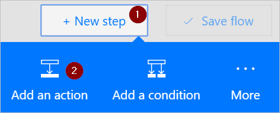

# <a name="use-expressions-in-conditions-to-check-multiple-values"></a>在条件中使用表达式来查看多个值
本演练将介绍如何使用表达式和条件在高级模式下比较多个值。

创建流时，可以在基本模式下使用[**条件**](add-condition.md#add-a-condition)卡将单个值和其他值进行快速比较。 但是，有时候需比较多个值。 例如，可能需要查看电子表格或数据库表中几个列的值。

可以在条件中使用以下逻辑表达式的任何组合。

表达式|说明|示例
--------|-----------|-------
|[and](#use-the-and-expression)|采用两个参数，如果两个值均为 true，则返回 true。<br>注意：<b></b>两个参数都必须为布尔型。|以下表达式返回 false： <br>and(greater(1,10),equals(0,0))
|[or](#use-the-or-expression)|采用两个参数，如果其中一个参数为 true，则返回 true。 <br>注意：<b></b>两个参数都必须为布尔型。|以下表达式返回 true：<br>or(greater(1,10),equals(0,0))
|equals|如果两个值相等，则返回 true。|例如，如果 parameter1 为 someValue，则以下表达式返回 true：<br>equals(parameters('parameter1'), 'someValue')
|[less](#use-the-less-expression)|采用两个参数，如果第一个参数小于第二个参数，则返回 true。 <br>注意：<b></b>支持的类型为整数、浮点和字符串。|以下表达式返回 true：<br>less(10,100)
|lessOrEquals|采用两个参数，如果第一个参数小于或等于第二个参数，则返回 true。 <br>注意：<b></b>支持的类型为整数、浮点和字符串。|以下表达式返回 true：<br>lessOrEquals(10,10)
|[greater](#use-the-greater-expression)|采用两个参数，如果第一个参数大于第二个参数，则返回 true。 <br>注意：<b></b>支持的类型为整数、浮点和字符串。|以下表达式返回 false：<br>greater(10,10)
|greaterOrEquals|采用两个参数，如果第一个参数大于或等于第二个参数，则返回 true。 <br>注意：<b></b>支持的类型为整数、浮点和字符串。|以下表达式返回 false：<br>greaterOrEquals(10,100)
|[empty](#use-the-empty-expression)|如果对象、数组或字符串为空，则返回 true。|以下表达式返回 true：<br>empty('')
|not|采用两个参数，如果参数为 false，则返回 true。 <br>注意：<b></b>两个参数都必须为布尔型。|以下表达式返回 true：<br>not(contains('200 Success','Fail'))
|if|如果表达式生成 true 或 false，则返回特定值。|以下表达式返回“yes”：<br>if(equals(1, 1), 'yes', 'no')

## <a name="prerequisites"></a>先决条件
* 有权访问 Microsoft Flow。
* 一个电子表格，其中的表在本演示后面有介绍。 确保将电子表格保存在 Microsoft Flow 能够访问的某个位置，例如 Dropbox 或 Microsoft OneDrive。
* Microsoft Office 365 Outlook（虽然我们使用 Office 365 Outlook，但你可以在流中使用任何受支持的电子邮件服务。）

## <a name="use-the-or-expression"></a>使用 or 表达式
有时候，如果某个项的值为 valueA 或 valueB，则工作流需采取操作。 例如，你可能在跟踪电子表格表中任务的状态。 假设该表有一个名为“状态”的列，“状态”列的可能值为：

* 已完成
* 已阻止
* 不必要
* 未启动

以下示例展示了该电子表格的外观：


对于前面的电子表格，你希望使用 Microsoft Flow 删除“状态”列设置为“已完成”或“不必要”的所有行。

让我们创建该流。

### <a name="start-with-a-blank-flow"></a>从空白流开始
1. 登录到 [Microsoft Flow](https://flow.microsoft.com)。

    
2. 选择“我的流”选项卡。

    
3. 选择“从零开始创建”。

    

### <a name="add-a-trigger-to-your-flow"></a>向流添加触发器
1. 搜索“计划”，然后选择“计划 - 重复周期”触发器

    
2. 将计划设置为每天运行一次。

    

### <a name="select-the-spreadsheet-and-get-all-rows"></a>选择电子表格，获取所有行
1. 选择“新建步骤” > “添加操作”。

    
2. 搜索“行”，然后选择“Excel - 获取行”。

    注意：请选择对应于要使用的电子表格的“获取行”操作。 例如，如果要使用 Google Sheets，则选择“Google Sheets - 获取行”。

    
3. 选择“文件名”框中的文件夹图标，浏览到相应的文件夹，然后选择包含你的数据的电子表格。

    
4. 从“表名”列表中选择包含你的数据的表。

    

### <a name="check-the-status-column-of-each-row"></a>查看每一行的状态列
1. 选择“新建步骤” > “更多” > “向每个都添加一个应用”。

    
2. 向“从先前的步骤中选择一个输出”框添加“值”令牌。

    
3. 选择“添加条件” > “在高级模式下编辑”。
4. 添加以下 or 表达式。 此 or 表达式检查表中每个行的值（在表达式中访问时，行称为项）。 如果“状态”列的值为“已完成”或“不必要”，则 or 表达式的求值结果为“true”。

    or 表达式如下所示：

    ````@or(equals(item()?['status'], 'unnecessary'), equals(item()?['status'], 'completed'))````

    “条件”卡如下图所示：

    

### <a name="delete-matching-rows-from-the-spreadsheet"></a>从电子表格中删除匹配的行
1. 选择该条件的“如果是，则不执行任何操作”分支上的“添加操作”。
2. 搜索“删除行”，然后选择“Excel - 删除行”。

    
3. 在“文件名”框中搜索并选择包含要删除数据的电子表格文件。
4. 从“表名”列表中选择包含你的数据的表。
5. 将“行 ID”令牌置于“行 ID”框中。

    

### <a name="name-the-flow-and-save-it"></a>命名流并将其保存
1. 给流命名，然后选择“创建流”按钮。

    

### <a name="run-the-flow-with-the-or-expression"></a>使用 or 表达式运行流
流在保存后运行。 如果已创建此前在本演示中显示的电子表格，则下面是在运行完成后该电子表格的情况：


注意，“状态”列为“已完成”或“不必要”的行中的所有数据均已删除。

## <a name="use-the-and-expression"></a>使用 and 表达式
假设电子表格表有两个列。 列名称为“状态”和“已分配”。 另假设需要删除“状态”列的值为“已阻止”、“已分配”列的值为“John Wonder”的所有行。  若要完成此任务，请执行本演示中前面介绍的所有步骤，但在以高级模式编辑“条件”卡时，请使用 and 表达式，如下所示：

````@and(equals(item()?['Status'], 'blocked'), equals(item()?['Assigned'], 'John Wonder'))````

“条件”卡如下图所示：


### <a name="run-the-flow-with-the-and-expression"></a>使用 and 表达式运行流
如果按步骤操作，则电子表格如下图所示：


在流运行后，电子表格如下图所示：


## <a name="use-the-empty-expression"></a>使用 empty 表达式
注意，电子表格中现在有多个空行。 若要删除这些空行，请使用 empty 表达式确定在“已分配”和“状态”列中没有任何文本的所有行。

若要完成此任务，请执行本演示中前面的“使用 and 表达式”部分列出的所有步骤，但在以高级模式编辑“条件”卡时，请按以下方式使用 empty 表达式：

````@and(empty(item()?['Status']), empty(item()?['Assigned']))````

“条件”卡如下图所示：


在流运行后，电子表格如下图所示：


注意，已从表中删除额外的行。

## <a name="use-the-greater-expression"></a>使用 greater 表达式
假设你为同事购买了棒球票，于是使用电子表格来确保每个人都付清款项。 你可以快速创建一个流，向每个尚未支付全款的人每日发送一封电子邮件。

使用 greater 表达式确定尚未支付全款的员工。 然后即可自动向那些尚未全额支付的员工发送一封善意的提醒邮件。

下面是该电子表格的视图：


下面显示了如何实现 greater 表达式，以便确定尚未全额支付所欠款项的所有人员：

````@greater(item()?['Due'], item()?['Paid'])````

## <a name="use-the-less-expression"></a>使用 less 表达式
假设你为同事购买了棒球票，于是使用电子表格来确保每个人在应允支付的日期之前都付清款项。 可以创建一个流，在当前日期离应允支付日期不到一天时，向每个尚未支付全款的人发送一封提醒邮件。

请将 and 表达式和 less 表达式配合使用，因为有两个条件需要验证：


|          要验证的条件          | 要使用的表达式 |                    示例                     |
|-----------------------------------------|-------------------|------------------------------------------------|
|   是否已全额支付到期的款项？    |      greater      |   @greater(item()?['Due'], item()?['Paid'])    |
| 是否离到期日期只有不到一天的时间？ |       less        | @less(item()?['DueDate'], addDays(utcNow(),1)) |

## <a name="combine-the-greater-and-less-expressions-in-an-and-expression"></a>在 and 表达式中将 greater 和 less 表达式组合到一起
使用 greater 表达式来确定尚未全额支付欠款的员工，使用 less 表达式来确定当前日期离应允支付的日期是否不到一天。 然后即可执行“发送电子邮件”操作，向那些尚未全额支付且离应允支付日期不到一天的人员发送善意的提醒邮件。

下面是该电子表格表的视图：


下面显示了如何实现 and 表达式，以便确定尚未全额支付所欠款项且当前日期离应允支付日期不到一天的所有人员：

````@and(greater(item()?['Due'], item()?['Paid']), less(item()?['dueDate'], addDays(utcNow(),1)))````

## <a name="learn-more"></a>了解详情
了解其他[表达式](https://docs.microsoft.com/azure/logic-apps/logic-apps-workflow-definition-language#functions)

