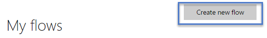
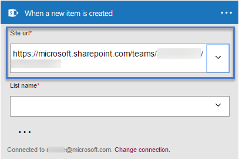

# 在 Microsoft Flow 中等待审批
<iframe width="560" height="315" src="https://www.youtube.com/embed/W6oxcYRtW-8?list=PL8nfc9haGeb55I9wL9QnWyHp3ctU2_ThF" frameborder="0" allowfullscreen></iframe>

创建一个流，该流会在用户已在 SharePoint 中创建某个项目的情况下发送审批邮件，然后通知用户该项目是被批准还是被拒绝。 若要完全按本教程的说明操作，请创建一个简单的 SharePoint 列表作为触发器操作，但可以使用其他数据源（例如 Dropbox 或 OneDrive）。

**先决条件**

* 创建一个简单的名为“项目跟踪程序”的 SharePoint Online 列表，其中包含名为“标题”的列，并添加名为“分配到”的“人员”列或“组”列。
  
   

## 添加一个可触发流的事件
1. 在 [flow.microsoft.com](https://flow.microsoft.com) 的顶部导航栏中选择“我的流”，然后选择“创建新流”。
   
    
2. 在“希望的启动方式”框中，键入或粘贴“新建项目”，然后选择“SharePoint Online - 创建新项目时”。
   
    
3. 如果系统提示，请登录到 SharePoint Online。
4. 在“站点 URL”下，键入或粘贴包含列表的站点 URL。
   
    
5. 在“列表名称”下，选择一个列表（例如“项目跟踪程序”）。
   
    

## 添加引发的操作
1. 选择“+”按钮，然后选择“添加操作”。
   
    
2. 在“下一步要执行的操作”框中，键入或粘贴“发送电子邮件”，然后选择“Office 365 Outlook - 发送审批电子邮件”。
   
    
3. 如果系统提示，请登录到 Office 365 Outlook。
4. 选择“收件人”字段，然后再选择“分配到电子邮件”。
   
    “分配到”列中的用户会收到批准或拒绝该项目的邮件。 创建一个用来测试流的项目时，用户需在此字段中指定自己。 这样用户就不但可以批准或拒绝该项目，而且可以收到通知邮件。
   
    **注意**：可以根据需要自定义“主题”字段和“用户选项”字段。
   
    

## 添加条件
1. 选择“+”按钮，然后选择“添加操作”。
   
    
2. 在“对象名称”字段中，选择“SelectedOption”。
3. 在“值”字段中，键入或粘贴“审批”。
   
    
4. 在“如果是”区域中，选择“添加操作”。
   
    
5. 在“下一步要执行的操作”框中，键入或粘贴“发送电子邮件”，然后选择“Office 365 Outlook - 发送电子邮件”。
   
    
6. 在“主题”框中指定主题。
   
    例如，可以选择“分配到 DisplayName”，键入“已批准”，两侧各留一空格，然后选择“标题”。
7. 在“正文”框中指定电子邮件正文，例如“准备继续下一阶段的项目。”
8. 在“收件人”字段中，输入收件人（例如“通过电子邮件创建”）。
   
    创建了 SharePoint 列表中项目的人将会收到项目被批准或拒绝的通知。
   
    
9. 在“如果否”区域中，重复最后五项步骤，区别是更改“主题”和“正文”，反映项目被拒绝这一事实。
   
     

## 完成并测试流
1. 为流提供一个名称，然后选择“创建流”。
   
     
2. 创建 SharePoint 列表中的项。
   
    审批邮件发送给指定的收件人。 当收件人在该邮件中选择“批准”或“拒绝”时，用户会收到指示响应结果的电子邮件。 

