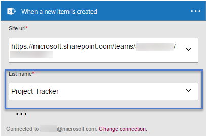
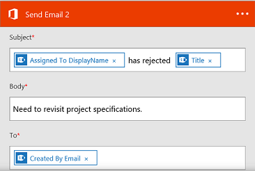

# 在 Microsoft Flow 中等待审批

> [!VIDEO https://www.youtube.com/embed/W6oxcYRtW-8?list=PL8nfc9haGeb55I9wL9QnWyHp3ctU2_ThF]
>

创建一个流，该流会在用户已在 SharePoint 中创建某个项目的情况下发送审批电子邮件，然后通知用户该项目是被批准还是被拒绝。 若要完全按本教程的说明操作，请创建一个简单的 SharePoint 列表作为触发器操作，但可以使用其他数据源（例如 Dropbox 或 OneDrive）。

**先决条件**

* 创建一个简单的名为“项目跟踪程序”的 SharePoint 列表，添加名为“标题”的列，然后添加名为“分配到”的“人员”列或“组”列。

   

## 添加一个可触发流的事件

1. 登录到 [Microsoft Flow](https://flow.microsoft.com)，在顶部导航栏中选择“我的流”，然后选择“从头开始创建”。

1. 选择“搜索数百个连接器和触发器”框，输入新项，然后导航到 SharePoint - 项创建时。

1. 如果系统提示，请登录到 SharePoint。
1. 在“网站地址”下，输入包含列表的 SharePoint 网站的 URL。

1. 在“列表名称”下，选择之前创建的列表。 如果你是按原步骤操作，则名称为“项目跟踪程序”。

    

## 添加引发的操作

1. 选择“新建步骤”，然后选择“添加操作”。

1. 在“搜索所有连接器和操作”框中，键入或粘贴“发送电子邮件”，然后选择“Office 365 Outlook - 发送带选项的电子邮件”。

1. 如果系统提示，请登录到 Office 365 Outlook。

1. 选择“收件人”字段，然后再选择“分配到电子邮件”令牌。

    “分配到”列中的用户会收到批准或拒绝该项的电子邮件。 创建一个用来测试流的项目时，请此字段中指定自己。 这样用户不但可以批准或拒绝该项目，而且还可以收到通知电子邮件。

    > [!NOTE]
    > 可以根据需要自定义“主题”字段和“用户选项”字段。

    

## 添加条件

1. 选择“新建步骤”按钮，然后选择“添加条件”。

    
1. 选择第一个框，然后选择“SelectedOption”令牌。
1. 选择最后一个框，然后键入批准。

    

1. 在“如果是”区域中，选择“添加操作”。

1. 在“搜索所有连接器和操作”框中，键入或粘贴“发送电子邮件”，然后选择“Office 365 Outlook - 发送电子邮件”。

1. 在“收件人”字段中，输入收件人（例如“通过电子邮件创建”）。

1. 在“主题”框中指定主题。

    例如，可以选择“分配到 DisplayName”，键入“已批准”，两侧各留一空格，然后选择“标题”。

1. 在“正文”框中指定电子邮件正文，例如“准备继续下一阶段的项目。”

    > [!NOTE]
    > 创建了 SharePoint 列表中项目的人将会收到项目被批准或拒绝的通知。

    

1. 在“如果否”区域中，重复最后五项步骤，区别是更改“主题”和“正文”，反映项目被拒绝这一事实。

     

## 完成并测试流

1. 为流提供一个名称，然后选择“创建流”。

     
1. 创建 SharePoint 列表中的项。

    审批电子邮件发送给指定的收件人。 当收件人在该电子邮件中选择“批准”或“拒绝”时，用户会收到指示响应结果的电子邮件。

## 了解详情

* [单个审批者现代审批演练](modern-approvals.md)
* 创建[顺序审批](sequential-modern-approvals.md)。
* 创建[并行审批](parallel-modern-approvals.md)。
* 批准[出差申请](mobile-approvals.md)
